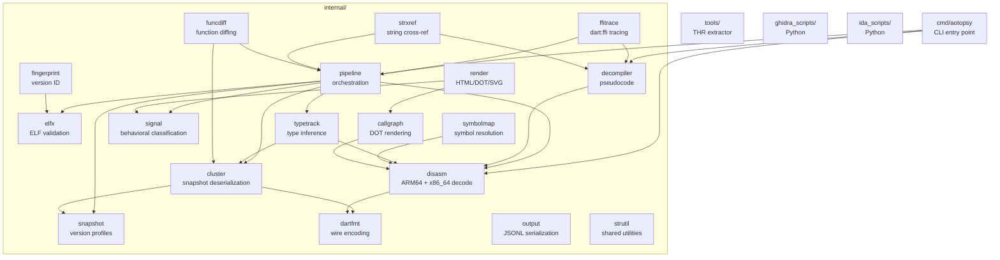

# AGENTS.md — AOTopsy

## ⚠️ Host memory: 6 GB. Read this before running anything heavy.

This dev box is a WSL2 VM with `memory=6GB` + 4 GB swap (`.wslconfig`). It has
already been crashed several times by analysis runs. Rules that actually work:

- **Cap below VM RAM, not above it.** `ulimit -v 2500000` (~2.5 GB). Setting it
  to 8 GB is a *fake* guard: the limit can never trigger before the VM itself
  runs out, so the VM dies instead of the process. `ulimit -v` is also
  per-process, so it says nothing about the sum of concurrent processes.
- **One heavy thing at a time, in the foreground.** Never background a pipeline
  run and keep working: `go test` in this repo runs full `Run()` pipelines of
  its own, so a background analysis plus a foreground `go test` is two
  pipelines at once. That combination has killed the VM.
- **Never run the full pipeline on a big real app** (e.g. a 129k-function
  libapp.so). For big-binary verification use the cluster-only harness
  (`clusterOnly` in `internal/pipeline/loadingunit_test.go`): ELF → snapshot →
  alloc → fill, skipping disassembly. It handles a 22 MB libapp.so in ~0.06 s.
- `aotopsy _debug decompile-native --all` on a real app is the single most
  dangerous command here — see its own `--max` help text.

## Build & Test

Do NOT use `./...` — it traverses `runtime_test/` (thousands of non-Go files) causing slow stat and OOM. Use:

```bash
go build ./cmd/... ./internal/... ./tools/...
go test ./cmd/... ./internal/... ./tools/...
```

Build just the binary: `go build -o aotopsy ./cmd/aotopsy/`

## Project Structure



- `cmd/aotopsy/` — CLI entry point, command handlers
- `internal/` — library packages (21 packages, see ARCHITECTURE.md)
- `tools/` — standalone utilities (THR table extractor)
- `ghidra_scripts/` — Ghidra integration (Python)
- `ida_scripts/` — IDA integration (Python)

## Integration Tests

Set environment variables to enable regression tests:

- `AOTOPSY_TEST_SAMPLE_ARM64` — Dart 3.9.2 ARM64 libapp.so
- `AOTOPSY_TEST_SAMPLE_312_ARM64` — Dart 3.12 ARM64 libapp.so
- `AOTOPSY_TEST_SAMPLE_312_X64` — Dart 3.12 x86_64 libapp.so
- `AOTOPSY_TEST_SAMPLE_DART212` — Dart 2.12.0 ARM64 libapp.so
- `AOTOPSY_TEST_SAMPLE_LARGE` — any large production libapp.so (cluster-only tests)

Tests skip automatically if not set.

### ⚠️ A Flutter build tree holds SEVERAL libapp.so — most are stale

`compare_sample/build` contains **five** `libapp.so` with five different hashes,
built from different revisions of `lib/*.dart`. Verified by string-grepping them:

| path | matches current source? |
|---|---|
| `build/app/intermediates/merged_native_libs/release/.../libapp.so` | ✅ yes |
| `build/app/intermediates/stripped_native_libs/release/.../libapp.so` | ✅ yes |
| `build/app/generated/jniLibs/copyJniLibsflutterBuildRelease/.../libapp.so` | ✅ yes |
| `build/app/outputs/flutter-apk/extracted_arm64/lib/arm64-v8a/libapp.so` | ❌ **STALE** |
| `build/app/outputs/flutter-apk/extracted_x64/lib/x86_64/libapp.so` | ❌ **STALE** |

The `extracted_*` ones predate `ground_truth.dart` entirely and contain no
`AntiInlineTools` / `safeDivide` / `tryCatchFinally`. Using them silently
invalidates any "compare the .dart source to the binary" check — absent symbols
look like tree-shaking or a parser bug when the code was simply never compiled
in. **Point the env vars at `merged_native_libs`**, and before trusting a
negative result (`--find X` returning 0 matches), confirm the symbol is in the
file: `strings -n 6 libapp.so | grep -x X`.

Timestamps do NOT reveal this — all five are same-day. Compare hashes and
grep for known symbols instead.

## Key Conventions

- `main.go`'s `switch` statement is the source of truth for command dispatch — always check it
- `PoolLookups` (`pipeline.PoolLookups`) is the central name-resolution surface
- PatchClass hop: `OwnerRefID` may point at a PatchClass (CID 6), not the real Class
- `DetectVersion` returns a copy to prevent data races
- `LiftState.Clone` shares Locals by reference (intentional for cross-branch visibility)

## File Editing Rules

**ALWAYS use the harness file tools (`read`, `edit`, `write`) for modifying files.**

- **NEVER use `sed`, `perl -i`, `awk`, or shell-based text substitution** to edit source files. These are prone to errors with CRLF/LF mismatches, escaping issues, and partial matches. The harness `edit` tool is guarded — it validates `old_string` uniqueness and preserves exact whitespace.
- **NEVER use `python3 -c` with inline `open()/replace()` to edit files** for the same reason. If a bulk change is truly needed, use `write` to rewrite the entire file (after `read`ing it first).
- Shell commands (`exec`) are for running builds, tests, git, and one-off diagnostics — NOT for file content modification.
- If `edit` fails with "String not found", read the file again to get the exact current content (tabs, spaces, line endings) before retrying. Do NOT fall back to `sed`.
