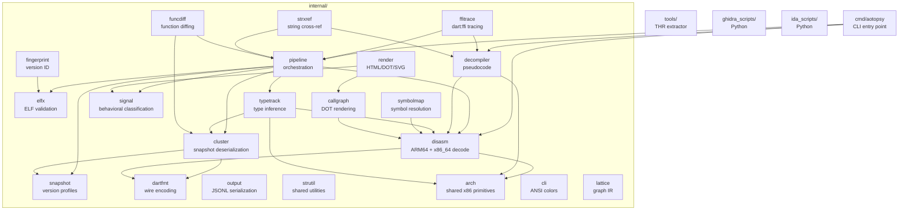

# AGENTS.md — AOTopsy

## ⚠️ MANDATORY: read `AGENTS-local.md` too

If `AGENTS-local.md` exists in the repo root, it MUST be read before working.
It contains local info (sample binary paths, env vars) not documented here.
Sample `libapp.so` and `ground_truth.dart` are not in the repo — they live in
`~/dev/` (see AGENTS-local.md).

That file is **intentionally not in git** (`.gitignore`); its role is like
`.env`: it holds paths and env vars for one machine, which would be wrong on
another. So a fresh clone won't have it — that's normal, not missing.
If it doesn't exist yet, create your own with sample paths and integration
test env vars for your machine.

## ⚠️ Host memory: 6 GB. Read this before running anything heavy.

This dev box is a WSL2 VM with `memory=6GB` + 4 GB swap (`.wslconfig`). It has
already been crashed several times by analysis runs. Rules that actually work:

- **Cap below VM RAM, not above it.** `ulimit -v 2500000` (~2.5 GB). Setting it
  to 8 GB is a *fake* guard: the limit can never trigger before the VM itself
  runs out, so the VM dies instead of the process. `ulimit -v` is also
  per-process, so it says nothing about the sum of concurrent processes.
- **One heavy thing at a time, in the foreground.** Never background a pipeline
  run and keep working: `go test` in this repo runs full `Run()` pipelines of
  its own, so a background analysis plus a foreground `go test` is two
  pipelines at once. That combination has killed the VM.
- **Never run the full pipeline on a big real app** (e.g. a 129k-function
  libapp.so). For big-binary verification use the cluster-only harness
  (`clusterOnly` in `internal/pipeline/loadingunit_test.go`): ELF → snapshot →
  alloc → fill, skipping disassembly. It handles a 22 MB libapp.so in ~0.06 s.
- `aotopsy _debug decompile-native --all` on a real app is the single most
  dangerous command here — see its own `--max` help text.

## Build & Test

Do NOT use `./...` — it traverses `runtime_test/` (thousands of non-Go files) causing slow stat and OOM. Use:

```bash
go build ./cmd/... ./internal/... ./tools/...
go test ./cmd/... ./internal/... ./tools/...
```

Build just the binary: `go build -o aotopsy ./cmd/aotopsy/`

## Project Structure



- `cmd/aotopsy/` — CLI entry point, command handlers
- `internal/` — library packages (21 packages, see ARCHITECTURE.md)
- `tools/` — standalone utilities (THR table extractor)
- `ghidra_scripts/` — Ghidra integration (Python)
- `ida_scripts/` — IDA integration (Python)

## Integration Tests

Set environment variables to enable regression tests:

- `AOTOPSY_TEST_SAMPLE_ARM64` — Dart 3.9.2 ARM64 libapp.so
- `AOTOPSY_TEST_SAMPLE_312_ARM64` — Dart 3.12 ARM64 libapp.so
- `AOTOPSY_TEST_SAMPLE_312_X64` — Dart 3.12 x86_64 libapp.so
- `AOTOPSY_TEST_SAMPLE_DART212` — Dart 2.12.0 ARM64 libapp.so
- `AOTOPSY_TEST_SAMPLE_LARGE` — any large production libapp.so (cluster-only tests)

Tests skip automatically if not set.

### ⚠️ A Flutter build tree holds SEVERAL libapp.so — most are stale

`compare_sample/build` contains **five** `libapp.so` with five different hashes,
built from different revisions of `lib/*.dart`. Verified by string-grepping them:

| path | matches current source? |
|---|---|
| `build/app/intermediates/merged_native_libs/release/.../libapp.so` | yes |
| `build/app/intermediates/stripped_native_libs/release/.../libapp.so` | yes |
| `build/app/generated/jniLibs/copyJniLibsflutterBuildRelease/.../libapp.so` | yes |
| `build/app/outputs/flutter-apk/extracted_arm64/lib/arm64-v8a/libapp.so` | **STALE** |
| `build/app/outputs/flutter-apk/extracted_x64/lib/x86_64/libapp.so` | **STALE** |

The `extracted_*` ones predate `ground_truth.dart` entirely and contain no
`AntiInlineTools` / `safeDivide` / `tryCatchFinally`. Using them silently
invalidates any "compare the .dart source to the binary" check — absent symbols
look like tree-shaking or a parser bug when the code was simply never compiled
in. **Point the env vars at `merged_native_libs`**, and before trusting a
negative result (`--find X` returning 0 matches), confirm the symbol is in the
file: `strings -n 6 libapp.so | grep -x X`.

Timestamps do NOT reveal this — all five are same-day. Compare hashes and
grep for known symbols instead.

## Key Conventions

- `main.go`'s `switch` statement is the source of truth for command dispatch — always check it
- `PoolLookups` (`pipeline.PoolLookups`) is the central name-resolution surface
- PatchClass hop: `OwnerRefID` may point at a PatchClass (CID 6), not the real Class
- `DetectVersion` returns a copy to prevent data races
- `LiftState.Clone` shares Locals by reference (intentional for cross-branch visibility)

## File Editing Rules

**ALWAYS use the harness file tools (`read`, `edit`, `write`) for modifying files.**

- **NEVER use `sed`, `perl -i`, `awk`, or shell-based text substitution** to edit source files. These are prone to errors with CRLF/LF mismatches, escaping issues, and partial matches. The harness `edit` tool is guarded — it validates `old_string` uniqueness and preserves exact whitespace.
- **NEVER use `python3 -c` with inline `open()/replace()` to edit files** for the same reason. If a bulk change is truly needed, use `write` to rewrite the entire file (after `read`ing it first).
- **NEVER use `python3 << 'PYEOF'` heredoc scripts to edit files** — this caused syntax errors (brace mismatch, CRLF issues, non-unique matches). The edit tool validates uniqueness and preserves exact whitespace. Heredoc python scripts bypass all safety checks.
- Shell commands (`exec`) are for running builds, tests, git, and one-off diagnostics — NOT for file content modification.
- If `edit` fails with "String not found", read the file again to get the exact current content (tabs, spaces, line endings) before retrying. Do NOT fall back to `sed` or python scripts.

**Why this rule exists (do not work around it):** every harness (Claude Code,
Devin, Codex, etc.) has its own edit/write tool that works like git — it
requires an exact `old_string`, rejects duplicate matches, and fails hard if
the context has changed. That is the safety guard. `sed`/`python replace()`
has no guard at all: if the string appears twice it replaces both, if the
file has changed it still writes, and CRLF/escape silently corrupt.

- This applies to ALL ways of invoking python/sed, including `python3 - <<'PY'`
  that reads a file then `open(...,'w').write(...)`. That form looks clean
  but still writes without verification — forbidden.
- Bulk edit is not an excuse: break into multiple `edit` calls, or `read`
  the whole file then `write` it.
- Python/sed MAY be used for things that do not write source files:
  computing, parsing output, analyzing JSONL/JSON results, writing helper
  scripts in `/tmp`. The boundary is clear — do not touch files inside the repo.
- Formatter (`gofmt -w`) is still allowed: it is a language tool whose job is
  to rewrite files deterministically, not ad-hoc text substitution.

**This has been violated before and it was expensive.** During the decompiler
porting session, `python3 - <<'PY'` was used for dozens of edits. Two of them
**silently did nothing**: `lift.go` and `arm64.go` were CRLF, while the
`replace()` pattern was written with `\n`, so `replace` returned the same
string and the file was rewritten with no change. No error, no warning. The
only sign something was wrong was a feature not firing (`x22` stayed 13600
when it should be 0) — caught only because the number happened to be checked.
The `edit` tool would have failed hard there because `old_string` didn't
match. That is the point.

Rule of thumb: if tempted to write `python3 - <<'PY'` containing
`open(...,'w')`, stop. Use `edit` multiple times, or `read` + `write`.

**And CRLF is not a reason to avoid `edit`.** A later session hesitated to
touch `ir.go`/`lift.go`/`emit.go`/`arm64.go` (all CRLF), then measured:
`edit` inserts a multi-line block (written with `\n`) and the file stays
**436/436 lines CRLF** — the insertion is normalized to match the file. So
the CRLF danger is specific to python/sed, not a property of the file. Note:
`gofmt -l` flags all CRLF files as "not formatted" (`call.go`,
`tryregion_test.go`, etc. have been that way since the start) — that is
baseline noise, not your edit's fault, and **do not** run `gofmt -w` to
"fix" it because it converts the entire file to LF.

## Engineering Philosophy

- **Do not take the easiest path.** If the correct fix requires a large
  refactor or signature change, do it. Example: `transferInstruction`
  signature was changed to pass `prevRaw` — this was key to the UBFX fix.
  "Changing the signature would require many changes" → DO IT ANYWAY.
- **Do not declare a "limitation" you haven't tried.** P7 async detection
  was declared "future work" when the fix (Future.delayed detection) was
  straightforward. Never declare something impossible without first
  attempting it.
- **Do not settle for "approximate" or "good enough"** when a real fix is
  achievable. The kHeapObjectTag off-by-one fix seemed trivial but unlocked
  11550 field hits from 11.
- **Root cause analysis must be deep.** Use gh search + gh api to the SDK
  source to verify every assumption. Do not guess. Example:
  ObjectStoreAOTFieldCount was wrong because it only counted RW fields,
  when there are also CW, FW, LAZY_CORE, LAZY_FFI, etc.
- **"Data limitation" is not the end of research.** If BLR is low, find
  alternative resolution paths (PP-loaded Code, THR stubs, object field
  calls). Do not stop at "dispatch table too small".

### Proven work order: check SDK → count → trace → change

This is not a preference. In this codebase **reading code produces
hypotheses, not findings** — measured on one investigation: four conclusions
from reading code, all four wrong; the answer came from a `println` that
wasn't even firing.

1. **Check data availability in the SDK before planning.** Two major plans
   were canceled before a single line was written, because the field simply
   doesn't exist in a release AOT snapshot: `allocation_stub_` (outside
   `to_snapshot(kFullAOT)`) and `var_descriptors` (`NOT_IN_PRODUCT`). Both
   would have been days wasted if started directly.
2. **Count ALL failure modes before choosing one.** Working example: 1335
   unnamed ranges were split into 910 "owner found, name empty" + 425 "owner
   not found", then measured that 910 of 910 could be resolved via the VM
   string table. The fix became a certainty, not a guess — and the result
   was exactly the predicted number.
3. **Trace with tests that replay the original instructions** before
   changing code. The "CMP kills the register it compares" bug was found
   this way, in one pass, after four rounds of reasoning failed.

### Cross-architecture counters are not necessarily comparable

Before concluding from a number difference, make sure both sides measure
the same population. Three real traps:

- `add_class_hits` 58x lower on x86_64 — **by design**:
  `flow_graph_compiler_x64.cc` folds slot arithmetic into the `CALL`
  addressing mode, while ARM64 emits `AddImmediate` first.
- `header_hits` 3x lower — ARM64 counts typed *and* untyped branches,
  x86 only typed.
- Golden with identical `wc -l` — 93 records inside changed.

A ratio computed from the wrong population also misleads: "70% of
narrowing sites are groundless" turned out to be 4%, because it was
computed from the `CMP` distribution in disassembly, not from sites that
actually fire.

### Do not send changes without measured results

A factually correct change with zero output impact is better canceled than
sent. A correctness fix that removes an unfounded claim is still worth
sending even if output hasn't changed — but **say so honestly** that it
doesn't buy anything.

## Known limits (do not claim solved)

- **Dispatch resolution on Dart 2.x is low** (2.12: 129 single-callee out
  of 5504 BLR, vs 3.9.2: 2378 out of 5354). The cause is not missing data —
  arity (`packed_fields_`) and `is_static` (`kind_tag_`) are already
  recovered for 7320/7320 functions. The cause is that 2.x passes
  arguments via the stack, not registers
  (`DartCallingConvention::kCpuRegistersForArgs` doesn't exist in
  `constants_arm64.h` at tag 2.12.0, exists at 3.9.2), so there is no
  receiver type at entry.
  Seeding `this` from a frame slot has been tried and **discarded**: the
  declaring class is not the exact runtime class, while dispatch lookup
  needs the exact one. Restricting to leaf classes is still wrong.
  Open lead, with evidence: `Layer` (cid 617) is abstract, its
  `findAnnotations` subclass implementations occupy cid 619-626, and
  `Layer.find` resolves via index 2482 while `findAnnotations` starts at
  2484 — consistent with the 2.x dispatch table being off by about two
  entries.
  **Confirm or refute that hypothesis first** before rebuilding the
  seeding. Do not enable seeding without it; wrong output is worse than
  `unresolved`.

## Two gates that must stay green

Both exist because of bugs that slipped through for months: the object pool
index was off by two slots, while the regression test only checked loose
ranges ("50-300 signal", "20000-50000 edge"). The total looked reasonable,
every line was wrong.

### 1. Golden output (`internal/pipeline/golden_test.go`)

SHA-256 per output file is compared against records in
`internal/pipeline/testdata/golden/`. The key is the input binary's SHA-256,
so pointing at a different `libapp.so` will SKIP (not fail).

```bash
go test ./internal/pipeline/ -run Golden                    # verify
AOTOPSY_UPDATE_GOLDEN=1 go test ./internal/pipeline/ -run Golden   # re-record
```

If it fails: **do not re-record immediately**. First find what changed;
re-record only after the change is understood and intentional.

Note that this gate compares **content**, not line count. A `B.AL` fix
slipped past a manual "same line count" check but was caught here:
`call_edges.jsonl` stayed 40502 lines while 93 of them got new `via`
annotations. To judge a golden diff, compare per-record (key → value), not
`wc -l`.

`TestGoldenOutputIsDeterministic` runs the pipeline twice and demands
byte-identical output — golden is meaningless if the output itself wobbles.
Any `for k := range someMap` writing to shared state, or `sort.Slice` with
a non-total key, will be caught here.

### 2. SDK drift (`tools/extract_thr.go`)

Thread offset tables and `ObjectStoreAOTFieldCount` cannot be validated by
any local test: a wrong offset produces a plausible-looking annotation
(`THR.allocate_object_stub`) but points at a different field. The only
truth is the SDK header that generated it.

```bash
go run tools/extract_thr.go -check              # THR tables vs SDK
go run tools/extract_thr.go -check-objectstore  # ObjectStore field count vs SDK
go run tools/extract_thr.go -write              # rewrite tables from SDK
AOTOPSY_TEST_SDK=1 go test ./internal/disasm/ -run MatchSDK   # both, as a test
```

THR tables in `internal/disasm/thrfields*.go` are generated code: change
via `-write`, do not hand-edit. Fields the SDK genuinely doesn't export
(`empty_array`, `dynamic_type`, etc. — see `handDerivedFields`) are listed
explicitly in the tool, not silently tolerated.

## Source of Truth: SDK Verification

Two techniques for verifying against Dart SDK source:

1. **gh search + gh api**: `gh search code "pattern" --repo dart-lang/sdk` to find files, then `gh api -H "Accept: application/vnd.github.raw" "repos/dart-lang/sdk/contents/path?ref=VERSION"` to read at specific version tag.
2. **websearch + gh api**: `web_search` for context/concept, then `gh api` for ground truth verification.

Both are necessary: websearch gives context, gh api gives ground truth. Never rely on just one.

### Critical lessons learned

- **ObjectStoreAOTFieldCount**: Must count ALL field macros (RW + CW + FW + LAZY_CORE + LAZY_ISOLATE + LAZY_FFI + LAZY_INTERNAL + LAZY_ASYNC + ARW_AR + ARW_RELAXED), not just RW. Counting only RW → wrong stream position → dispatch table parsed from wrong position → BLR=0.
- **from() differs between versions**: 2.12.0 ObjectStore::from() = &object_class_, 3.9.2 = &list_class_. IsolateObjectStore::from() is different and NOT used for serialization.
- **Class ID extraction differs**: 2.x uses LDURH (16-bit, kClassIdTagPos=16), 3.x uses LDUR+UBFX (64-bit, kClassIdTagPos=12).
- **Dispatch pattern differs**: 2.x uses cid_reg in-place (SUB X0, X0, #imm), 3.x uses LR as temp (SUB X30, X0, #imm).
