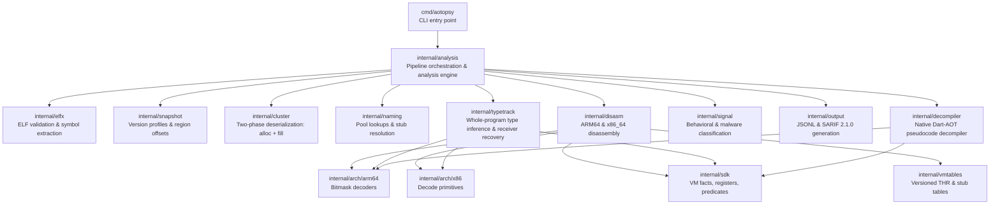
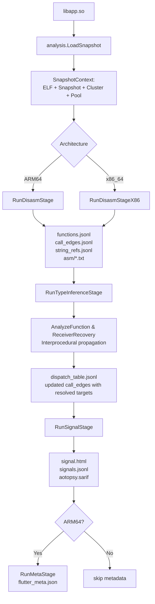

# AOTopsy — Architecture

Deep dive into the codebase: package responsibilities, data flow, key data structures, and the non-obvious conventions a contributor needs to know.

## Overview

AOTopsy takes a `libapp.so` (a Flutter app's compiled Dart AOT snapshot inside an ELF `.so`) and produces function names, call graphs, class layouts, behavioral signals, and readable pseudocode — without running the Dart VM.

The system is organized into modular layers:
1. **Front half**: ELF parsing, snapshot region extraction, and cluster deserialization (`elfx`, `snapshot`, `dartfmt`, `cluster`).
2. **Analysis engine**: Pipeline orchestration, disassembly, type tracking, receiver recovery, and behavioral signals (`analysis`, `disasm`, `typetrack`, `signal`, `naming`, `arch/arm64`, `sdk`, `vmtables`, `thraudit`).
3. **Decompiler backend**: Multi-pass AST restructuring, SSA value-graph, async linearizer, and whole-project source synthesis (`decompiler`, `frida`, `strutil`).
4. **Outputs & Tools**: SARIF 2.1.0, JSONL, HTML/DOT graphs, Ghidra/IDA integration, and SDK verification tools (`output`, `render`, `jsonutil`, `tools`).

---

## Package Reference

### `internal/analysis`

Orchestrates the analysis pipeline and provides reusable analysis engines. `Run()` is the central pipeline entry point:

1. **`LoadSnapshot`** (`snapshot_loader.go`): The single source of truth for opening `libapp.so` and executing the full 10-step snapshot parse sequence (ELF → snapshot extract → isolate cluster scan+fill → instructions table → code ranges → code region → VM snapshot parse → pool lookups → pool display).
2. **`SnapshotContext`** & **`AnalysisContext`** (`context.go`): High-level structured wrappers bundling the snapshot results, symbol tables, and cached function IR representations.
3. **`RunDisasmStage` & `RunDisasmStageX86`** (`disasm_stage.go`, `disasm_stagex86.go`): Deterministic, chunk-based parallel disassembly producing `functions.jsonl`, `call_edges.jsonl`, `string_refs.jsonl`, and annotated assembly.
4. **`RunTypeInferenceStage`** (`typetrack_stage.go`): Whole-program type inference resolving BLR dispatch call sites and writing `dispatch_table.jsonl`.
5. **`RunSignalStage`** (`signal_stage.go`): Behavioral classification, entropy scanning, taint analysis, YARA-style matching, and behavioral call-graph evaluation.
6. **`RunMetaStage`** (`meta_stage.go`): Emits `dart_meta.json` and `flutter_meta.json` (ARM64 only) for Ghidra/IDA metadata injection.

### `internal/sdk`

The central source of truth for ground-truth Dart VM architecture facts, register conventions, and compiler predicates. Verified directly against upstream `dart-lang/sdk`:

- **`registers.go`**: Register roles and calling conventions:
  - ARM64: `PP=R27`, `THR=R26`, `DT=R21`, `HEAP_BITS=R28`, `CODE=R24`, `ARGS_DESC=R4`, `NULL_REG=R22`. Calling convention arguments: `[R1, R2, R3, R5, R6, R7]`.
  - x86_64: `PP=R15`, `THR=R14`, `CODE=R12`, `ARGS_DESC=R10`. Calling convention arguments: `[RDI, RSI, RDX, RBX, R8, R9]`.
- **`predicates.go`**: Recognition of compiler code idioms:
  - Write-barrier checks (`IsWriteBarrierCond`) and stack-overflow checks (`IsStackOverflowCond`).
  - Boolean vs null offset discrimination: `kTrueOffsetFromNull = 32`, `kFalseOffsetFromNull = 48`.
- **`stubclass.go`**: Stub classification (`IsMundaneStub`, `ClassifyStubRole`) ensuring compiler utility stubs are identified without suppressing runtime-critical entry points.
- **`x86_decode.go` & `x86_helpers.go`**: Unified x86 instruction wrapper (`X86Decoded`), relative branch resolution, and conditional jump classifiers.

### `internal/vmtables` & `internal/thraudit`

- **`internal/vmtables`**: Generated, versioned tables for Thread-relative offsets (`thrfields.go`, `thrfieldsx64.go`), stub names (`stubnames.go`), stub orderings (`stuborder.go`), and thread stubs (`threadstubs.go`) covering Dart 2.10 through 3.13+.
- **`internal/thraudit`**: Audit and security classification (`thrclassify.go`) of thread field accesses.

### `internal/arch/arm64`

Centralized bitmask instruction decoders (`decoders.go`): `LDR64UnsignedOffset`, `STR64UnsignedOffset`, `LDUR64`, `LDUR32`, `LDURH`, `DstRegOfInst`, `ADD64Immediate`, `SUB64Immediate`, `BL`, `BLR`, `B`, `B.cond`, `CBZ`, `CBNZ`, `TBZ`, `TBNZ`. Shared across `disasm`, `decompiler`, `typetrack`, and `symbolmap`.

### `internal/arch/x86`

Centralized x86_64 decode primitives (`helpers.go`, `decode.go`): `CanonReg` (register width folding), `RelTarget` (PC-relative branch resolution), `IsCondJump` (conditional branch classification), `EqualitySuccessor` (which edge proves equality), `Walk`/`Decode`/`DecodeUntilBad` (linear decode sweep with bad-byte recovery). Shared across `disasm`, `decompiler`, `typetrack`, `analysis`, `frida`, and `symbolmap`.

### `internal/naming`

Central name-resolution, pool lookup, and stub symbolization surface:

- **`pool.go`** (`PoolLookups`): Maps object references (`RefToStr`, `RefToNamed`, `RefCID`, and VM-isolate mirrors) to qualified Dart symbols.
- **`stubs.go`**:
  - `BuildVMStubSymbols`: Resolves VM isolate stub Code objects using creation-order `VM_STUB_CODE_LIST`.
  - `BuildDiscardedFunctionSymbols`: Recovers names for functions whose Code object was discarded in DWARF stack traces mode (`dwarf_stack_traces_mode`) via `Function.CodeIndex`.
  - `BuildTTSCallTargets` & `TtsCallTarget`: Resolves indirect type-testing stub call sites via object pool indexes.
- **`codeowner.go`**: Resolves code ownership and constructor name prefixing (`"new "`).

### `internal/elfx`

Thin wrapper around `debug/elf`. Validates 64-bit ELF, accepts `EM_AARCH64` and `EM_X86_64`. Extracts snapshot regions by looking up well-known symbols (`_kDartIsolateSnapshotData`, `_kDartVmSnapshotData`, `_kDartIsolateSnapshotInstructions`, `_kDartVmSnapshotInstructions`).

### `internal/snapshot`

Parses snapshot headers (magic `0xf5f5dcdc`, 32-byte version hash, features string) and selects a `VersionProfile` — a struct of per-Dart-version format flags declaring how each object type is encoded. `DetectVersion` returns a copy to prevent concurrent data races.

### `internal/dartfmt`

Dart's variable-length integer wire encodings (`ReadUnsigned`, `ReadRefId`, etc.) via `dartfmt.Stream`.

### `internal/cluster`

Core two-phase snapshot deserializer:
1. **Alloc** (`ScanClusters`): Walks clusters in CID order, assigns sequential ref IDs.
2. **Fill** (`ReadFill`): Walks clusters again, reading field values, strings, and scalars via `fillspec.go` and `fill_scalar_handlers.go`.

Includes `dispatchtable.go` for parsing the snapshot's instance dispatch table (classifying entries into `DispatchCode`, `DispatchStub`, `DispatchNull`).

### `internal/disasm`

ARM64 & x86_64 disassembly, CFG construction, and call-edge extraction:
- **Register provenance**: CFG-wide forward dataflow tracking pool loads (`PP`), thread fields (`THR`), dispatch tables (`DT`), and code entry-point offsets (`IsCodeEntryPointDisp`).
- **Arity reconstruction**: Contiguous 12-instruction backward scan (`inferCallArgRegMaskLocal`) estimating parameter counts from argument register setups.

### `internal/typetrack`

Whole-program type inference and receiver recovery:
- **Receiver recovery** (`receiver_recovery.go`): Overcomes the pre-Dart-3.4.3 calling convention gap (where `this` was passed on the stack) by analyzing prologue frame loads and validating against declared class fields (`OwnerHasFieldAt`).
- **Lattice propagation** (`intraproc.go`, `interproc.go`): 5-level abstract interpretation lattice (`Top`, `KnownClass`, `KnownDispatchIndex`, `KnownStub`, `Bottom`) tracking receiver types across basic blocks and call boundaries.

### `internal/decompiler`

Dart-AOT-aware native pseudocode decompiler (ARM64 + x86_64):
1. **IR Lift** (`lift.go`, `liftarm64.go`, `liftx86.go`): Machine code converted to SSA instructions with canonical register value-graphs.
2. **Exception Handling**: PC bounds bound mathematically via `ExceptionHandlerTable` and `PcDescriptors`.
3. **Multi-Pass AST Compaction**:
   - Control-flow restructuring: `for-in`, `while`, `for`, `try-catch-finally` (`stmt_for_in.go`, `stmt_loops.go`).
   - Async/Await linearizer: Unwraps `_SuspendState` state machines into linear `await` expressions (`async_linearizer.go`).
   - Closure synthesis: Inlines `AllocateClosure` callbacks as arrow functions at call sites (`stmt_closure.go`).
   - Idiom recognition: Cascades (`..`), null-aware navigation (`?.`, `??`), Set/List/Map literals, string interpolation (`stmt_idioms.go`).
4. **Whole-Project Synthesizer** (`project_synthesizer.go`): Reconstructs full modular `.dart` projects mapped by library URIs.

### `internal/output`

Output artifact writers:
- **SARIF 2.1.0** (`sarif.go`): Emits schema-compliant security finding reports for GitHub Code Scanning with severity mappings for anti-tamper, SSL pinning, crypto, and behavioral signals.
- **JSONL**: Structured serialization for functions, call edges, classes, and string references.

### `internal/frida`

Ready-to-run Frida script generator (`generator.go`, `export.go`, `import.go`):
- Emits `Interceptor.attach()` hooks dumping declared argument registers and return values.
- Injects instruction-level probes at unresolved indirect call sites (`dynamicCall`) to log runtime target addresses.

### `internal/signal`

Behavioral and security signal classification: crypto algorithms, network endpoints, authentication, SIM/SMS, location, device fingerprinting, and malware patterns.

### `internal/jsonutil`

Generic JSONL stream readers (`ReadJSONL[T]`) and writers (`WriteJSONLFile`), extracted from the pipeline package so every consumer shares one implementation instead of copy-pasting bufio.Scanner loops.

### `internal/cli`

ANSI color constants and logging helpers (`MakeLogf`, `MakeStagef`) for CLI stage output, extracted from the pipeline package.

### `cmd/aotopsy`

Thin CLI entry point (~30–60 lines per handler). Dispatches primary user commands and `_debug` diagnostic subcommands directly to `internal/analysis`.

---

## Key Data Flow

---

## Version Handling

| Dart Version Range | Object Tagging | Pointer Mode | Key Architecture Characteristics |
|---|---|---|---|
| **2.10 – 2.13** | CID-Int32 | Uncompressed | 4–5 header fields, per-subclass / shared String ROData, receiver on stack frame |
| **2.14 – 2.17** | CID-Shift1 | Uncompressed | CID shifted into uint64 tag, 1-based `code_index` (0=LazyCompile) |
| **2.18 – 3.3** | CID-Shift1 | Compressed | Signed refs, 32-bit compressed pointers, prologue receiver recovery active |
| **3.4 – 3.13+** | ObjectHeader | Compressed | New tag encoding, record types, register-based DartCallingConvention |

Snapshot version detection matches the 32-byte git snapshot hash against version profiles derived from the Dart SDK source.
