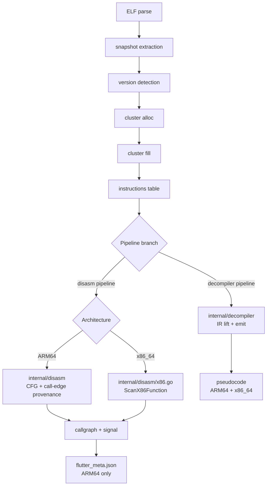
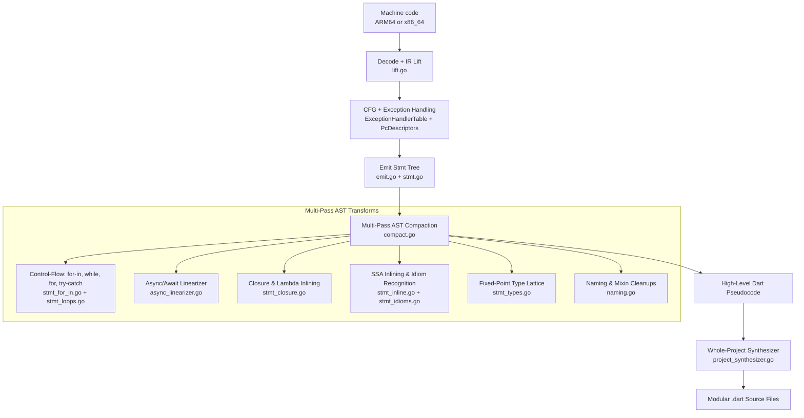
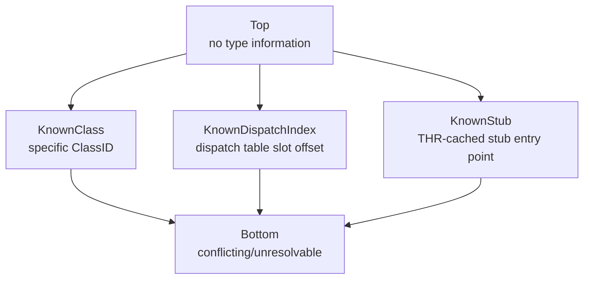
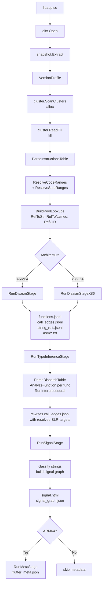
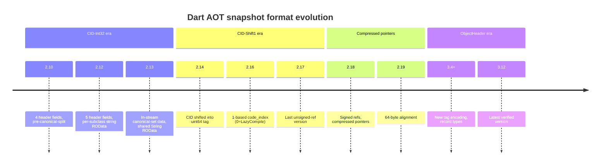

# AOTopsy — Architecture

Deep dive into the codebase: package responsibilities, data flow, key data structures, and the non-obvious conventions a contributor needs to know.

## Overview

AOTopsy takes a `libapp.so` (a Flutter app's compiled Dart AOT snapshot inside an ELF `.so`) and produces function names, call graphs, class layouts, behavioral signals, and readable pseudocode — without running the Dart VM.

Two pipelines share the same front half, then split by architecture:



The two pipelines are independent. `internal/decompiler` has its own disassembly/CFG/lift/emit chain — it doesn't use `internal/disasm`'s output. Within the disasm pipeline, ARM64 and x86_64 are also separate implementations that converge on the same JSONL schema.

## Package Reference

### `internal/elfx`

Thin wrapper around `debug/elf`. Validates 64-bit, accepts `EM_AARCH64` and `EM_X86_64`. Extracts snapshot regions by looking up well-known ELF symbols (`_kDartIsolateSnapshotData`, `_kDartVmSnapshotData`, etc.).

### `internal/snapshot`

Locates snapshot data/instructions regions inside the ELF, parses the snapshot header (magic `0xf5f5dcdc`, 32-byte version hash, features string), and selects a `VersionProfile` — a struct of per-Dart-version format flags that is the single source of truth for "how does version X serialize object Y."

`DetectVersion` returns a copy of the profile, not the shared package-level pointer, to prevent data races when callers mutate `CompressedPointers`.

CID tables and format constants are derived from the Dart SDK source (BSD-3-Clause) — see `NOTICE`.

### `internal/dartfmt`

Dart's variable-length integer encodings (`ReadUnsigned`, `ReadRefId`, etc.). Every other package reads through a `dartfmt.Stream`. Small, stable, heavily reused — if a read is misaligned, the bug is almost never here.

### `internal/cluster`

The core package. Dart AOT snapshots serialize in two passes:

1. **Alloc** (`ScanClusters`): walk clusters in CID order, each declaring an object count. Assigns sequential ref IDs. No data read yet.
2. **Fill** (`ReadFill`): walk the same clusters again, reading field values — string bytes, ref IDs, scalars. The fill encoding is declared per-CID by `FillSpec` in `fillspec.go`. Per-CID scalar reading is split across `fill_scalar_handlers.go` into 6 handlers (Function, FunctionType, Field, Type, Script, LoadingUnit), each with a fallback to `skipScalar` to keep the stream aligned.

Key types:
- `NamedObject` — the universal "this ref has a name and/or owner" record
- `ClassInfo` — per-class layout: ClassID, SuperTypeRefID, LibraryRefID
- `FieldInfo`, `FuncTypeInfo`, `TypeInfo` — per-CID metadata extracted during fill

**PatchClass hop**: Dart wraps patched/mixin-applied classes in a `PatchClass` (CID 6). A Function/Field's `OwnerRefID` frequently points at a PatchClass, not the real Class. The owner resolution pattern hops through it:

```go
effectiveClass := no.OwnerRefID
if owner, ok := pl.RefToNamed[no.OwnerRefID]; ok && owner.CID == ct.PatchClass {
    effectiveClass = owner.OwnerRefID
}
```

This pattern appears in `internal/funcdiff`, `cmd/aotopsy/refinfo.go`, and `cmd/aotopsy/decompile_native_cmd.go`.

**DispatchTable** (`dispatchtable.go`): Full parsing of the AOT snapshot's dispatch table — the mechanism behind megamorphic/polymorphic instance dispatch. Entries are classified as `DispatchNull`, `DispatchCode`, or `DispatchStub`. Reaching the table requires replaying the isolate snapshot's roots section (ObjectStore fields + initial_field_table + shared_initial_field_table). Works for Dart 3.1.0–3.12.2.

### `internal/disasm`

ARM64 disassembly via `arm64asm.Decode`, CFG construction (3-phase leader/partition/successor algorithm), and call-edge extraction.

**Register provenance** for indirect calls (BLR on ARM64, CALL reg on x86_64) uses a CFG-wide forward dataflow (`ExtractCallEdgesCFG`), not a fixed instruction window. Provenance survives across basic blocks for as long as it's genuinely live, bounded by real control-flow reachability.

The three-state lattice: top (no info), known (e.g. "PP[42] Widget.build"), bottom (conflicting). Meet = intersection.

Provenance types:
- **PP** (object pool): `LDR Xt, [X27, #imm]` — pool index = byte_offset / 8
- **THR** (thread): `LDR Xt, [X26, #imm]` — resolved via version-specific offset maps
- **Peephole PP**: `ADD Xd, X27, #hi; LDR Xt, [Xd, #lo]` — two-instruction pool access
- **Dispatch table**: `LDR Xn, [X21, Xm, LSL #3]`

`x86.go` and `dataflow_x86.go` provide the equivalent for x86_64, using `PP=R15`, `THR=R14`, `CODE_REG=R12` (from `dart-lang/sdk`'s `constants_x64.h`). The x86_64 code deliberately doesn't share types with ARM64 — `Inst.Raw` is `uint32` (ARM64's fixed 4-byte width), which doesn't fit x86_64's variable-length encoding.

**THR field tables** (`thrfields.go`, `thrfields_x64.go`): Per-Dart-version, per-architecture maps of Thread-relative byte offsets to field names. Derived from `dart-lang/sdk`'s `runtime_offsets_extracted.h`.

**THR-cached stub offsets** (`threadstubs.go`): Maps for the small set of extremely hot VM runtime stubs (write barrier, allocation, stack-overflow check, safepoint) that Dart AOT loads directly from Thread rather than through the object pool. Offsets copied from `runtime_offsets_extracted.h`, cross-checked empirically against real sample disassembly.

**VM stub names** (`stubnames.go`): Per-Dart-version ordered `VM_STUB_CODE_LIST` expansion, naming the VM isolate's stub Code objects by creation-order index.

**Shared stub detection** (`sharedstub.go`): Recognizes compiler-synthesized "shared stub" Code objects with no owning Function — a different category from discarded-Code functions (which DO have a recoverable name).

### `internal/callgraph`

Converts disasm's CFG/call-edge output into [lattice](https://github.com/zboralski/lattice) graph types for DOT rendering. `cfg_x86.go` sources from `internal/decompiler`'s x86 CFG lifter.

### `internal/signal`

Regex/heuristic classification of string references into behavioral categories: crypto, network, auth, URL, base64, SIM, SMS, contacts, location, device info, cloaking, data collection, camera, WebView, blockchain, gambling, attribution. Generic pattern matching, not tied to any specific app.

BLR (indirect call) edges are included in the signal graph's BFS adjacency, not just BL (direct call) edges — without them, signal functions reachable only via indirect calls don't pull their callers/callees into the context set.

### `internal/render`

HTML/DOT/SVG output for call graphs and signal reports. BLR edges in the class graph are rendered with dotted/dashed lines to distinguish from BL edges.

### `internal/output`

JSONL serialization helpers for artifact files.

### `internal/decompiler`

Dart-AOT-aware high-level decompiler supporting both ARM64 and x86_64, producing idiomatic Dart source code.



1. **Decode & IR Lift** (`lift.go`, `lift_arm64ops.go`, `lift_x86.go`) — instructions become `Instr` structs with `Op` classification and tracked register/stack expressions. Frame setup instructions (`STP/LDP FP, LR`) and stack-check boilerplate (`CMP SP, THR.stack_limit`) are elided at this stage.
2. **Ground-Truth Exception Handling** (`internal/cluster` PCD & `ExceptionHandlerTable`) — PC ranges for try-catch-finally blocks are bound mathematically from snapshot metadata rather than heuristic branch guessing.
3. **AST Statement Tree** (`stmt.go`, `stmt_expr.go`) — the decompiler lifts bytecode into a structured AST of `Stmt` (`Line`, `Construct`, `Block`), enabling safe non-regex tree transformations.
4. **Async/Await Linearizer** (`async_linearizer.go`) — decompiles Dart async state machines (`_SuspendState`), flattening state jumps into linear `await future` statements and `await for` streams.
5. **Closure & Lambda Synthesis** (`stmt_closure.go`) — links `AllocateClosure` / `_Closure` instantiations to their enclosing lexical parents and inlines them as arrow functions `(arg) => body` at call sites.
6. **Idioms & SSA Compactor** (`stmt_idioms.go`, `stmt_inline.go`) — inlines single-use temporaries, recovers `for-in` iterators, cascade operators (`..`), null-aware navigation (`?.`, `??`, `??=`), Set/List/Map literals, and string interpolation (`"${a}${b}"`).
7. **Type Inference Lattice** (`stmt_types.go`) — propagates concrete Dart types (`String`, `int`, `UserModel`) across SSA definitions using fixed-point abstract interpretation.
8. **Whole-Project Synthesizer** (`project_synthesizer.go`) — organizes decompiled functions by `ClassTable` and `LibraryTable`, reconstructing classes (`class`, `extends`, `with`, fields, constructors, methods) into modular `.dart` files mapped by original library URIs.

The emitter has hard backstops against combinatorial blowup: `maxDepth=20`, `maxVisitCount=24`, `maxStepsPerEmitter=20000`. These prevent host memory exhaustion during large-scale analysis.

### `internal/typetrack`

Whole-program type inference to resolve indirect (BLR) call sites. Infers the runtime ClassID of receiver objects at each call site, then maps `class_id + selector_offset → dispatch table slot → target function`.

Type lattice (5 levels):



`AnalyzeFunction` runs a forward CFG worklist algorithm: build blocks, initialize entry types, transfer function per instruction, meet at block exits, repeat to fixed point. On BLR instructions, attempts to resolve the dispatch target.

The per-instruction transfer function is split across `intraproc_handlers.go` (ARM64) and `intraproc_x86.go` (x86_64). Each handler covers one instruction category (stack store/load, THR/PP load, dispatch arithmetic, field load, UBFX, MOV, BLR, BL) and returns true to consume the instruction or false to fall through to the next handler.

`TypeContext` holds precomputed lookup tables: function parameter types, field types, pool class mappings, dispatch table entries, superclass relationships, code index to function mappings. Construction is split across `sources_builders.go` into 10 sub-builders (class hierarchy, field types, pool class, dispatch tables, func param types, instance field types, closure data, etc.).

`callconv.go` holds Dart's AOT calling convention (`dartArgRegisters`), verified against `constants_arm64.h` and `constants_x64.h` — NOT the platform C ABI. ARM64: `{R1,R2,R3,R5,R6,R7}`, x86_64: `{RDI,RSI,RDX,RBX,R8,R9}`.

Inter-procedural propagation (`interproc.go`) passes parameter types from callers to callees across function boundaries.

### `internal/pipeline`

Orchestrates the full analysis pipeline. `Run()` is the entry point:

1. ELF open + snapshot extract
2. Cluster alloc + fill
3. Instructions table + code ranges
4. Disassembly (ARM64 or x86_64)
5. Type inference (BLR resolution)
6. Signal analysis
7. Metadata generation (ARM64 only)

`PoolLookups` is the central name-resolution surface: `RefToStr`, `RefToNamed`, `RefCID`, plus VM-isolate mirrors. Almost every `cmd/aotopsy/*.go` file reads from it.

`LoadContext` factors the setup sequence into a reusable entry point for per-function tools (ffitrace, strxref, dispatch-table).

**Discarded-Code function naming** (`discardedfuncs.go`): Functions whose Code object was discarded by the compiler (gated on `dwarf_stack_traces_mode`) are name-recoverable via `Function.CodeIndex` — the same scheme Dart's own runtime uses for crash-stack symbolication. No external DWARF file needed.

**VM stub symbols** (`vmstubs.go`): Parses the VM-isolate snapshot region and returns a VA→name map for stub Code objects.

### `internal/fingerprint`

Identifies build-id, architecture, and Flutter/Dart engine version markers from an ELF file without any Dart-snapshot-aware parsing. Parses ELF note sections and scans for ASCII version strings. Reports a confidence level (high/medium/low).

### `internal/funcdiff`

Diffs the function set between two `libapp.so` builds. Uses AOTopsy's own cluster parser for function identity (`<owner_class>::<name>` descriptor), with PatchClass hop and VM base-object string table fallback.

### `internal/symbolmap`

Resolves stripped binary call/branch targets against an unstripped build of the same binary. Disassembles the stripped binary's direct call/branch instructions, resolves each target VA against the unstripped side's function symbols (exact match or nearest-symbol-at-or-below).

### `internal/ffitrace`

Static detection of `dart:ffi` `DynamicLibrary.open`/`.lookup` call sites. Resolves literal library/symbol names when passed directly. Bounded to 500 functions by default — an unbounded sweep drove 5.4GB RSS on an 8GB-RAM machine during development.

### `internal/strxref`

String-to-function cross-referencing. Given a string, finds every function that loads it from the object pool. Unbounded by default — safe because it only builds IR (no pseudocode emission), measured at 9.3 seconds with flat memory on a 129,000-function binary.

### `internal/strutil`

Shared string utilities: `SanitizeFilename`, `SanitizeIdentifier`. Replaces three previously-duplicated implementations.

### `internal/arch`

Architecture-neutral primitives shared across `disasm`, `decompiler`, and `typetrack`: `X86CanonReg` (register canonicalization), `X86RelTarget` (rel32 branch target), `IsX86CondJump` (conditional jump classification), `X86EqualitySuccessor` (B.cond/JE successor convention). Replaces 7 duplicated copies across 3 packages. The `SuccEqual`/`SuccNotEqual`/`SuccUnknown` convention is shared between ARM64 and x86_64 equality-branch handling; the functions themselves are NOT merged because their inputs are different types (raw 32-bit ARM64 word vs `x86asm.Op`).

### `cmd/aotopsy`

CLI entry point. `main.go`'s `switch` statement dispatches commands — always check it to find which file handles a command. Commands are split into primary (`aotopsy <cmd>`) and debug (`aotopsy _debug <cmd>`) namespaces.

### `tools/extract_thr.go`

Standalone utility for extracting Thread field offset tables from `dart-lang/sdk`'s `runtime_offsets_extracted.h` for all supported Dart versions and architectures. Outputs Go map literals for pasting into `thrfields.go`.

## Key Data Flow



## Version Handling



| Dart | Tag Style | Pointers | Key change |
|------|-----------|----------|------------|
| 2.10 | CID-Int32 | Uncompressed | 4 header fields, pre-canonical-split |
| 2.12 | CID-Int32 | Uncompressed | 5 header fields, per-subclass string ROData |
| 2.13 | CID-Int32 | Uncompressed | In-stream canonical-set data, shared String ROData |
| 2.14 | CID-Shift1 | Uncompressed | CID shifted into uint64 tag |
| 2.16 | CID-Shift1 | Uncompressed | 1-based code_index (0=LazyCompile) |
| 2.18 | CID-Shift1 | Compressed | Signed refs, compressed pointers |
| 3.4+ | ObjectHeader | Compressed | New tag encoding, record types |

The version hash selects a constraint set. Same pipeline runs. No version-conditional architecture.

## x86_64 Port Status

Everything except Ghidra/IDA headless decompilation supports x86_64. The blocker is a Dart-AOT-specific function-boundary problem: Ghidra's `createFunction()` follows control flow past the real function end on x86_64 due to variable-length instruction encoding (unlike ARM64's fixed 4-byte alignment). `decompile-native` works on both architectures because it uses its own function boundaries from the snapshot's instructions table, not Ghidra's heuristic boundary detection.
