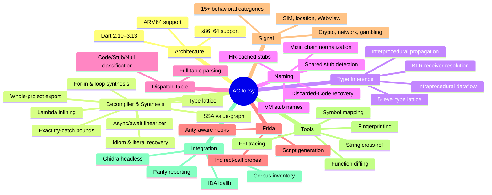

# Changelog

All notable changes to AOTopsy are documented in this file.

The format is based on [Keep a Changelog](https://keepachangelog.com/en/1.1.0/),
and this project adheres to [Semantic Versioning](https://semver.org/spec/v2.0.0.html).

## [Unreleased]

### Added
- `SECURITY.md` — supported versions, private vulnerability reporting for parser bugs, and release-binary checksum verification.
- GitHub Actions CI: cross-platform build + `vet` + test matrix (linux/amd64, darwin/arm64, windows/amd64) plus a linux `-race` + coverage job; runs on every push/PR to `main`/`develop`.
- README **Accuracy & Honesty** section publishing named, ground-truth metrics: name-recovery agreement ≥ 0.81 vs the app's own ELF `.symtab` (19 Dart-version twins), 100% valid-Dart, 0% fabrication.
- README **Limitations & Scope** section documenting the verified hard AOT floors (instance field names ~97–99% dropped by `Precompiler::DropFields`, local/captured names, truly polymorphic dispatch) versus engineering scope.

### Changed
- Dart coverage documented as **2.10 → 3.13** (3.13.2 is the current stable frontier; snapshot support is structure-based, not version-number-gated).
- Fork attribution updated: the original `zboralski/unflutter` repository was removed by the author; credit retained, with a pointer to the `KristijanZic/unflutter` continuation.

## [1.0.0] - 2026-08-26

First stable, tagged release with prebuilt, checksummed cross-platform binaries.

### Added
- **Whole-Project Dart Source Synthesizer** — `export-dart` reconstructs complete `.dart` class and module files from snapshot metadata and decompiled bytecode.
- **Dual-Architecture High-Level Decompiler** — produces idiomatic Dart directly from ARM64 and x86_64 machine code without a live VM.
- **Canonical-register SSA value-graph** — one value slot per physical register (ARM64 `w`/`x`, x86 sub-registers), ~90% raw-register reduction over baseline with identical CFG coverage; a re-emission cap collapses the duplication explosion.
- **Fixed-Point Abstract Type Lattice** — infers and emits concrete Dart types (`String`, `int`, `UserModel`) across SSA definitions without an emulator.
- **Async/Await State-Machine Linearizer** — unwraps `_SuspendState` transitions into linear `await future` statements and `await for` streams.
- **Lambda & Anonymous Closure Inlining** — inlines `AllocateClosure` instances into arrow functions `(item) => expr` at call sites.
- **Control-Flow & Idiom Synthesis** — reconstructs `for-in`, `while`/`for`, cascades (`..`), null-aware navigation (`?.`, `??`, `??=`), Set/List/Map literals, and string interpolation.
- **Ground-Truth Exception Handling** — ingests `ExceptionHandlerTable` and `PcDescriptors` for exact try/catch/finally bounds.
- **Adversarial Binary Resilience** — 2-level shifted ObjectPool arithmetic (`<< 12`), IEEE 754 float64 constants, frame-setup elision, signed 64-bit two's-complement hex, `w22` `NULL_REG` seeding, unspaced mixin-chain cleanup.
- **Dual-architecture support** — ARM64 and x86_64 share the snapshot parser front half with separate disassembly backends.
- **Dart 2.10–3.13 coverage** — version-specific layouts verified against `dart-lang/sdk` source at each version tag; a 19-Dart-version ground-truth symtab differential gate (agreement floor 0.81).
- **Whole-program type inference** — `internal/typetrack` resolves BLR receiver types via intraprocedural dataflow + interprocedural propagation.
- **Dispatch table parsing** — full `DispatchTable` decode with entry classification (Code/Stub/Null).
- **THR-cached stub resolution** — thread-relative indirect calls resolved to real names from `runtime_offsets_extracted.h`.
- **VM stub naming** — VM isolate stub Code objects named by `VM_STUB_CODE_LIST` creation order.
- **Discarded-Code function naming** — functions whose Code object was discarded are recoverable via `Function.CodeIndex`.
- **Frida script generation** — `--gen-frida` emits hooks for runtime verification of static results.
- **Signal classification** — 15+ behavioral categories (crypto, network, gambling, SIM, location, WebView, blockchain, attribution).
- **Tooling** — string cross-referencing, FFI call-site tracing, fingerprinting, function diffing, symbol mapping, Ghidra/IDA integration (ARM64), and corpus tools (`inventory`, `parity`, `find-libapp`, `dart2-buckets`, `thr-audit`/`thr-cluster`/`thr-classify`).

### Fixed
- `Code.OwnerRef` x86_64 unreliability fixed project-wide (CodeIndex-based resolution preferred).
- Dispatch table indexing off-by-one (1-based for Dart ≥ 2.16, 0-based for ≤ 2.15).
- Signal classification false positives (RefCID check against OneByteString/TwoByteString before quoting).
- x86_64 signal graph edge mapping (call/call_indirect vs bl/blr).
- Dart 2.12.0 string extraction (0 → 8,529 isolate strings).
- Compressed pointer load tracking (BLR resolution improvement).
- `STUR` imm9, `STP`/`LDP` imm7, qualified name lookup fixes.
- Memory layout overlap at large sample scale (`UC_ERR_MAP`).
- `DetectVersion` returns a copy to prevent data races.
- `ParseDispatchTable` caps length against `len(data)*8`; `ResolveStubRanges` caps `FirstEntryWithCode` — malformed-input hardening.
- `find-libapp` temp path bug (`./scratch` → `os.CreateTemp("")`).
- `B.cond` bit mask in typetrack (23 → 19 bits); `meetType` preserves `KnownStub` when identical.
- x86_64 typetrack completeness: stack tracking, field lookup, LEA dispatch, allocation-stub detection.
- `knownVoidSelectors` non-void entries removed (`IOSink.write()` returns `Future`).
- THR-store FFI detection scoped to the `vm_tag` field (was any THR store — 43,528 x86_64 false positives).
- ROData payload alignment (`kObjectAlignmentLog2=4`).
- `recordFieldStore` unanimity: conflicting stores drop the entry instead of first-write-wins.
- `funcKindMask` version-keyed decoding (2.10 4→5-bit, 2.18 5→4-bit) — SDK gate across 22 versions.
- VM stub names reversed (image laid out backwards from `VM_STUB_CODE_LIST`).
- x86_64 calling convention corrected to `{RDI,RSI,RDX,RBX,R8,R9}`.
- x86_64 compressed-pointer decompression made identity on the type lattice.
- Async detection: shared `asyncStubRole` between `call.go` and `emit.go`.
- `invertCondition` regex character-class fix; `replaceIdent` skips string literals.
- `LoadContext` fd leak in `frida_export.go` (7 manual `Close()` → one `defer`).
- `readFillInstance` unboxed read locked to `kBitsPerWord/kBitsPerInt32`.

### Changed
- Lint configured (`.golangci.yml`); `errcheck`/`gofmt`/`goimports`/`gosec`/`staticcheck` findings resolved.
- Large monoliths split: `transferInstruction` (860 lines → 10 handlers), `readFillRefs` (200 → 6), `BuildTypeContext` (456 → 10 sub-builders), `buildFuncIR` (202-line closure → `funcIRBuilder`).
- Shared packages replace duplication: `internal/strutil` (3 copies), `internal/arch` (7 x86 helpers across 3 packages, −247 lines).
- Dead code removed; package doc comments added; regression tests use `AOTOPSY_TEST_SAMPLE_*` env lookups; `NOTICE` added for Dart SDK derived-data attribution.

---

## Feature overview

[Unreleased]: https://github.com/BroNils/aotopsy/compare/v1.0.0...HEAD
[1.0.0]: https://github.com/BroNils/aotopsy/releases/tag/v1.0.0
