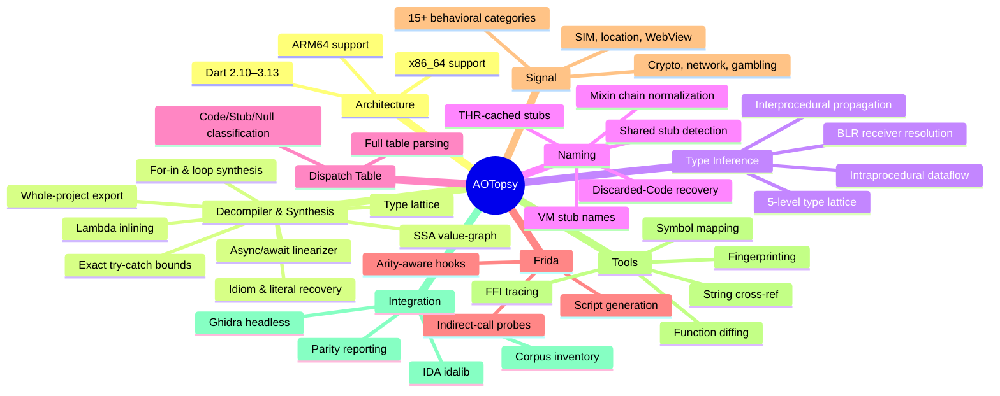

# Changelog

All notable changes to this project will be documented in this file.

The format is based on [Keep a Changelog](https://keepachangelog.com/en/1.1.0/),
and this project adheres to [Semantic Versioning](https://semver.org/spec/v2.0.0.html).

## [Unreleased]

### Added
- **Unified Snapshot Loader (`LoadSnapshot`)** — centralized 10-step snapshot initialization pipeline in `internal/analysis/snapshot_loader.go` replacing 8 previously copy-pasted setup blocks.
- **Dedicated Dart VM SDK Ground-Truth Package (`internal/sdk`)** — centralized register roles, DartCallingConvention argument sets (`DartArgRegisters`), write barrier / stack overflow predicates, cached VM object values, stack-slot naming, pointer-decompression detection, and stub classification directly verified against `dart-lang/sdk`.
- **Versioned VM Tables Package (`internal/vmtables`) & Thread Audit (`internal/thraudit`)** — versioned Thread offset maps and stub orderings covering Dart 2.10 through 3.13+.
- **Centralized ARM64 Bitmask Instruction Decoders (`internal/arch/arm64`)** — shared bitmask decoders for branch, arithmetic, load/store, and register operations, eliminating 15+ duplicated decoder functions across `disasm`, `typetrack`, and `decompiler`.
- **SARIF 2.1.0 Security Finding Export** — schema-compliant SARIF output in `internal/output/sarif.go` with automated validation tests (`internal/output/sarif_test.go`) for seamless GitHub Code Scanning integration.
- **Pre-Dart-3.4.3 Prologue Receiver Recovery** — `internal/typetrack/receiver_recovery.go` recovers the stack-frame receiver slot for Dart 2.12–3.3.0 apps, closing the calling-convention gap with `OwnerHasFieldAt` validation.
- **SSA Reaching-Definition Fixpoint** — `internal/decompiler/ssa.go` (445 lines) replaces the forward-join with a complete all-predecessor, back-edge-including fixpoint. Loop-carried registers are materialized as phi induction locals with an induction discriminator (exactly 1 write + self-reference).
- **Generational Write-Barrier Elision** — both ARM64 (`HEAP_BITS` mask test) and x86_64 (`THR.write_barrier_mask` AND) barrier checks are detected and elided, verified against `assembler_arm64.cc` and `assembler_x64.cc`.
- **String Literal Hoisting** — `internal/decompiler/hoist_strings.go` replaces repeated long string literals (>40 chars, >1 occurrence) with function-local `const _strN`, deterministic (first-appearance order, longest-first).
- **CompressedStackMaps Decoding** — `internal/cluster/compressedstackmaps.go` decodes CSM payloads (LEB128 entries, 3 CSM types) for future register liveness at safepoints.
- **Closure Dispatch BLR Resolution** — `ClosureInfo` capture + `PoolClosureFunctionNames` map resolves BLR through pool-loaded Closure objects to their wrapped Function name.
- **UnlinkedCall BLR Enhancement** — `MethodNameToSelectorOffsets` cross-references the dispatch table to resolve UnlinkedCall BLR sites via selector scan, same as dispatch-table BLR.
- **`-check-roots` SDK Gate** — verifies `RootsPrefixRefCount` for Dart 3.13.0+ against `roots.h`, `symbol_list.h`, `stub_code_list.h`, `class_id.h` via `gh api`.
- **Metadata `compressed_pointers` Serialization** — propagates `compressed_pointers` boolean flag through `FlutterMetaJSON` for Ghidra and IDA integration.
- **Continuous Fuzzing CI** — `.github/workflows/fuzz.yml` runs Go native fuzz targets weekly on the untrusted-binary parsers.
- **`make analyze` Target** — cross-checks `export-dart` output against the real Dart analyzer (`dart analyze`), reporting syntax errors and total analyzer issues.

### Changed
- **Architecture Refactoring** — `internal/pipeline` → `internal/analysis`, `internal/lattice` → `internal/callgraph`, `internal/arch` → `internal/sdk` + `internal/arch/arm64`, THR/stub tables extracted from `disasm` → `internal/vmtables`, THR classification → `internal/thraudit`, decompiler statement passes → `internal/decompiler/stmt/`, comparison tools → `internal/decompiler/compare/`, Frida generation → `internal/frida`, naming/pool lookups → `internal/naming`, JSONL helpers → `internal/jsonutil`, CLI helpers → `internal/cli`, Dart sanitization → `internal/strutil`.
- **CLI Cleanliness** — CLI entrypoints in `cmd/aotopsy` slimmed down to pure argument-parsing dispatchers (~30–60 lines each). Deprecated command aliases removed.
- **Dead Helper Elimination** — removed redundant wrapper functions in `helpers.go`, calling standard library primitives directly.
- **Go Source Filename Normalization** — normalized x86 source files (`disasm_stagex86.go`, `cfgx86.go`, `dataflowx86.go`, `intraprocx86.go`, `thrfieldsx86.go`, `x86refs.go`) to avoid unwanted Go build tag filtering and maintain `x86` suffix consistency (testdata `.json` files keep `x64` to match sample filenames).
- **x86_64 Calling Convention Fix** — corrected from C ABI `{RDI,RSI,RDX,RCX,R8,R9}` to Dart's own `{RDI,RSI,RDX,RBX,R8,R9}` (RCX is `kClassIdReg`, not an argument register).
- **Code Entry-Point Displacement Fix** — `IsCodeEntryPointDisp` now checks all 6 tagged displacements `{0x3,0x7,0xb,0xf,0x17,0x1f}` across compressed and uncompressed modes, accounting for `FieldAddress(base, disp - kHeapObjectTag)`.
- **ARM64 Decoder Deduplication** — 15+ duplicated decoder functions consolidated into `internal/arch/arm64/decoders.go` with corrected masks (`MOVOrr` mask `0xFF200000` excluding Rd, `DstRegOfInst` covering MOVZ/MOVK/MOVN with `0xFF800000`).

### Fixed
- **SARIF JSON Schema Compliance** — restored `omitempty` on optional fields and `StartColumn` in physical location regions.
- **Framework URL Classification** — unified `IsFrameworkLibraryURL` usage across decompiler and analysis stages.
- **Cross-Version Metric Gaps** — updated differential testing known gaps for Dart 2.13.0/arm64 store hits.
- **Inline Frame Wiring** — `wireInlineFrames` now called in `FuncIRFor`, restoring inline frame annotations that were lost when `funcir_builder.go` was deleted.
- **Switch/Case Recovery** — `wireSwitchCases` ported from deleted `funcir_builder.go`, restoring IndirectGoto pattern detection for ≥16-case switch tables.
- **ClosureData/TypeParameters Capture** — restored `isClosureData` and `isTypeParameters` assignments in `fill_refs.go` that were accidentally deleted, fixing symtab differential for 8 Dart 2.13–2.16 samples.

## [1.1.0] - 2026-08-26

Reliability & public-trust release: verifiable accuracy, signed releases, and a hardened parser.

### Added
- **Public name-recovery benchmark** — `BENCHMARK.md`, a ground-truth scoreboard scoring recovered names against each build's own ELF `.symtab`: 89.8% overall agreement across 44 builds (up to Dart 3.13.0 at 92.2%), 81.3% worst band. Regenerate with `make bench`. The accuracy claim no competing Flutter AOT tool publishes.
- **Automated signed releases** — GoReleaser pipeline building linux/darwin/windows × amd64/arm64 with SHA256 checksums, a keyless (Sigstore/OIDC) cosign signature of the checksum file, per-archive SBOMs, and a SLSA build-provenance attestation. Triggered by pushing a `v*` tag.
- **`aotopsy --version`** — reports version/commit/date, injected at release time.
- **Fuzz-hardened parsers** — Go native fuzz targets on the untrusted-binary byte parsers (image header, instructions section, CodeSourceMap, PcDescriptors); crash-safe over ~3.7M executions, and permanent regression guards in CI.
- **`SECURITY.md`** — supported versions, private vulnerability reporting for parser bugs, and release-binary verification (checksums + `cosign verify-blob` / `gh attestation verify`).
- **CI** — cross-platform build + `vet` + test matrix (linux/amd64, darwin/arm64, windows/amd64) plus a linux `-race` + coverage job on every push/PR.
- **README Accuracy & Honesty** and **Limitations & Scope** sections publishing named metrics (≥ 0.81 name-recovery floor, 100% valid-Dart, 0% fabrication) and the verified hard AOT floors (field names ~97–99% dropped by `Precompiler::DropFields`, local names, polymorphic dispatch).

### Changed
- Dart coverage documented as **2.10 → 3.13** (3.13.2 stable frontier; structure-based, not version-number-gated); 3.13.0 verified in the differential at 92.2%.
- Fork attribution updated: the original `zboralski/unflutter` was removed by the author; credit retained, pointer to the `KristijanZic/unflutter` continuation. `blutter` link corrected to `worawit/blutter`.
- CHANGELOG restructured to Keep a Changelog / SemVer.

## [1.0.0] - 2026-08-26

First stable, tagged release with prebuilt, checksummed cross-platform binaries.

### Added
- **Whole-Project Dart Source Synthesizer** — `export-dart` reconstructs complete `.dart` class and module files from snapshot metadata and decompiled bytecode.
- **Dual-Architecture High-Level Decompiler** — produces idiomatic Dart directly from ARM64 and x86_64 machine code without a live VM.
- **Canonical-register SSA value-graph** — one value slot per physical register (ARM64 `w`/`x`, x86 sub-registers), ~90% raw-register reduction over baseline with identical CFG coverage; a re-emission cap collapses the duplication explosion.
- **Fixed-Point Abstract Type Lattice** — infers and emits concrete Dart types (`String`, `int`, `UserModel`) across SSA definitions without an emulator.
- **Async/Await State-Machine Linearizer** — unwraps `_SuspendState` transitions into linear `await future` statements and `await for` streams.
- **Lambda & Anonymous Closure Inlining** — inlines `AllocateClosure` instances into arrow functions `(item) => expr` at call sites.
- **Control-Flow & Idiom Synthesis** — reconstructs `for-in`, `while`/`for`, cascades (`..`), null-aware navigation (`?.`, `??`, `??=`), Set/List/Map literals, and string interpolation.
- **Ground-Truth Exception Handling** — ingests `ExceptionHandlerTable` and `PcDescriptors` for exact try/catch/finally bounds.
- **Adversarial Binary Resilience** — 2-level shifted ObjectPool arithmetic (`<< 12`), IEEE 754 float64 constants, frame-setup elision, signed 64-bit two's-complement hex, `w22` `NULL_REG` seeding, unspaced mixin-chain cleanup.
- **Dual-architecture support** — ARM64 and x86_64 share the snapshot parser front half with separate disassembly backends.
- **Dart 2.10–3.13 coverage** — version-specific layouts verified against `dart-lang/sdk` source at each version tag; a 19-Dart-version ground-truth symtab differential gate (agreement floor 0.81).
- **Whole-program type inference** — `internal/typetrack` resolves BLR receiver types via intraprocedural dataflow + interprocedural propagation.
- **Dispatch table parsing** — full `DispatchTable` decode with entry classification (Code/Stub/Null).
- **THR-cached stub resolution** — thread-relative indirect calls resolved to real names from `runtime_offsets_extracted.h`.
- **VM stub naming** — VM isolate stub Code objects named by `VM_STUB_CODE_LIST` creation order.
- **Discarded-Code function naming** — functions whose Code object was discarded are recoverable via `Function.CodeIndex`.
- **Frida script generation** — `--gen-frida` emits hooks for runtime verification of static results.
- **Signal classification** — 15+ behavioral categories (crypto, network, gambling, SIM, location, WebView, blockchain, attribution).
- **Tooling** — string cross-referencing, FFI call-site tracing, fingerprinting, function diffing, symbol mapping, Ghidra/IDA integration (ARM64), and corpus tools (`inventory`, `parity`, `find-libapp`, `dart2-buckets`, `thr-audit`/`thr-cluster`/`thr-classify`).

### Fixed
- `Code.OwnerRef` x86_64 unreliability fixed project-wide (CodeIndex-based resolution preferred).
- Dispatch table indexing off-by-one (1-based for Dart ≥ 2.16, 0-based for ≤ 2.15).
- Signal classification false positives (RefCID check against OneByteString/TwoByteString before quoting).
- x86_64 signal graph edge mapping (call/call_indirect vs bl/blr).
- Dart 2.12.0 string extraction (0 → 8,529 isolate strings).
- Compressed pointer load tracking (BLR resolution improvement).
- `STUR` imm9, `STP`/`LDP` imm7, qualified name lookup fixes.
- Memory layout overlap at large sample scale (`UC_ERR_MAP`).
- `DetectVersion` returns a copy to prevent data races.
- `ParseDispatchTable` caps length against `len(data)*8`; `ResolveStubRanges` caps `FirstEntryWithCode` — malformed-input hardening.
- `find-libapp` temp path bug (`./scratch` → `os.CreateTemp("")`).
- `B.cond` bit mask in typetrack (23 → 19 bits); `meetType` preserves `KnownStub` when identical.
- x86_64 typetrack completeness: stack tracking, field lookup, LEA dispatch, allocation-stub detection.
- `knownVoidSelectors` non-void entries removed (`IOSink.write()` returns `Future`).
- THR-store FFI detection scoped to the `vm_tag` field (was any THR store — 43,528 x86_64 false positives).
- ROData payload alignment (`kObjectAlignmentLog2=4`).
- `recordFieldStore` unanimity: conflicting stores drop the entry instead of first-write-wins.
- `funcKindMask` version-keyed decoding (2.10 4→5-bit, 2.18 5→4-bit) — SDK gate across 22 versions.
- VM stub names reversed (image laid out backwards from `VM_STUB_CODE_LIST`).
- x86_64 calling convention corrected to `{RDI,RSI,RDX,RBX,R8,R9}`.
- x86_64 compressed-pointer decompression made identity on the type lattice.
- Async detection: shared `asyncStubRole` between `call.go` and `emit.go`.
- `invertCondition` regex character-class fix; `replaceIdent` skips string literals.
- `LoadContext` fd leak in `frida_export.go` (7 manual `Close()` → one `defer`).
- `readFillInstance` unboxed read locked to `kBitsPerWord/kBitsPerInt32`.

### Changed
- Lint configured (`.golangci.yml`); `errcheck`/`gofmt`/`goimports`/`gosec`/`staticcheck` findings resolved.
- Large monoliths split: `transferInstruction` (860 lines → 10 handlers), `readFillRefs` (200 → 6), `BuildTypeContext` (456 → 10 sub-builders), `buildFuncIR` (202-line closure → `funcIRBuilder`).
- Shared packages replace duplication: `internal/strutil` (3 copies), `internal/arch` (7 x86 helpers across 3 packages, −247 lines).
- Dead code removed; package doc comments added; regression tests use `AOTOPSY_TEST_SAMPLE_*` env lookups; `NOTICE` added for Dart SDK derived-data attribution.

---

## Feature overview

[Unreleased]: https://github.com/BroNils/aotopsy/compare/v1.1.0...HEAD
[1.1.0]: https://github.com/BroNils/aotopsy/compare/v1.0.0...v1.1.0
[1.0.0]: https://github.com/BroNils/aotopsy/releases/tag/v1.0.0
