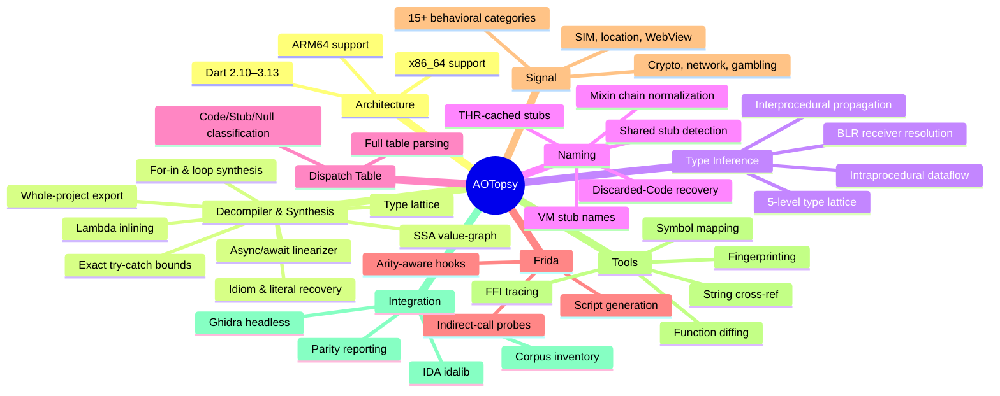

# Changelog

All notable changes to this project will be documented in this file.

The format is based on [Keep a Changelog](https://keepachangelog.com/en/1.1.0/),
and this project adheres to [Semantic Versioning](https://semver.org/spec/v2.0.0.html).

## [Unreleased]

### Fixed
- **An unresolved x86_64 pool load left the destination register carrying its
  previous provenance.** Removing the fabricated `pp[0]` fallback took the
  `else` branch away entirely, so `mov reg, [PP+disp]` with a displacement that
  names no pool slot neither defined nor killed `reg`. The block then reported
  itself as transparent for that register, and the reaching-definitions fixpoint
  carried the note from *before* the load straight through — a stale claim
  attributed to an instruction that had overwritten it. The load now kills the
  register: an unresolved slot is unknown, not zero and not whatever was there a
  moment ago. Measured 0 of 47,172 pool loads across three x64 samples reach this
  path, so nothing observable changes today; it is a correctness hole, not an
  active defect.
- **The same hole in type inference.** `handleX86Load` returned early on an
  unresolvable pool index without touching the destination's type, so a
  `KnownClass` survived a load it did not survive. `KnownClass` is authoritative
  downstream — it selects dispatch targets. The destination is now `Top`.
- **A conditional jump with an unresolvable target no longer swallows the branch.**
  The unified block partitioner classified it `FlowNormal`, so no leader was
  placed after it and the block did not end — quieter than the pre-unification
  partitioner, which split and emitted the fallthrough edge alone. Unreachable on
  the corpus (0 of 120,814 conditional jumps; every x86-64 Jcc carries a
  rel8/rel32), fixed because a silently merged basic block is expensive to notice.
- **`NO_COLOR` now beats `CLICOLOR_FORCE`.** Detection checked force first, so
  `NO_COLOR=1 CLICOLOR_FORCE=1` emitted escapes at a user who had opted out.
  Ordering matched against `muesli/termenv`, whose `EnvNoColor` documents that
  `NO_COLOR` is honoured "ignoring CLICOLOR/CLICOLOR_FORCE". `CLICOLOR=0` remains
  the weaker request and still yields to force, and a forced run on `TERM=dumb`
  gets plain 16-colour ANSI rather than nothing.
- **`--graph` draws call targets in per-function CFGs again.** Routing the
  renderer from `internal/callgraph` to `internal/render` dropped them: the old
  renderer read `BasicBlock.Calls`, and `disasm.BasicBlock` has no such field. The
  CFG showed where a block branched but no longer what it called.

### Changed
- **One implementation of function slicing.** The `PCOffset - CodeOff` / clamp /
  add-CodeVA arithmetic was written out by hand at nineteen call sites across six
  packages; it now lives once in `cluster.CodeImage`, which `analysis.CodeImage`
  embeds and extends with naming. Sites that only needed a virtual address
  previously skipped both the clamp and the underflow check, so a range beginning
  before the image produced an address near 2^64 instead of being rejected.
  `SliceExact` is the all-or-nothing variant for content hashing, where a clamped
  read would digest something that is not the function.

### Added
- **JSONL schema gates.** `functions.jsonl`, `call_edges.jsonl`,
  `string_refs.jsonl`, `unresolved_thr.jsonl`, ffi-trace findings and strxref
  references now have tests pinning their exact wire keys and their `omitempty`
  sets. These names are a published interface, and a renamed key fails silently on
  both sides — it decodes to the zero value. That is how `string_refs.jsonl`'s
  caller name reached the Frida exporter as `""`: the writer said `func`, the
  reader asked for `from_func`, and neither complained.
- **A test that reads a `.dot`.** Golden covers the JSONL artifacts only, so the
  graph output had no coverage at all, which is why the CFG regression above went
  unnoticed.
- `analysis.DefaultMaxScan` replaces `ffitrace`'s private copy of the same number.
  After the scan loop moved to `analysis`, that copy survived only in ffitrace's
  test, which therefore asserted against a constant that no longer drove anything.

## [1.4.0] - 2026-09-03

The per-version VM tables are now generated from dart-lang/sdk, and every
hand-maintained layer that used to fill the generator's gaps has been deleted
rather than corrected. Each of those layers was wrong in a way that could not
go red — the defects here were in the things meant to be checking the tables,
not in the tables.

### Fixed
- **Runtime-entry names were missing on x86_64.** `mergeRuntimeEntries` listed
  only 14 of the 27 x64 Thread tables, so the rest rendered every runtime-entry
  call site as an unnamed `THR.fNN` — 1015 unnamed entries in total, all x64.
  Both architectures are now covered by construction: `thrV3130_x64` goes from
  31 named entries to 162, and the 3.9.2 x64 table from ~110 to 205.
- **Leaf runtime entries were named as their neighbours.** The hand-typed leaf
  base offsets were one slot high. `runtime_offsets_extracted.h` exports the
  leaf anchor on three versions, and on all three it sits at
  `exit_through_ffi+8` — one slot below where these calls placed it (3.12.2
  used `0x710` against the SDK's `0x708`). Every leaf entry the layer did name
  was therefore shifted by one position.
- **`extract_thr -check-runtime-entries` could not fail.** It printed counts and
  returned 0 unconditionally, under a comment stating the committed tables did
  not exist yet — untrue since v1.3.0's generator work. A gate that cannot go
  red reads exactly like a gate that passes. It now compares every entry in
  `RUNTIME_ENTRY_LIST` and `LEAF_RUNTIME_ENTRY_LIST` against the committed
  tables across all 46 version/arch pairs, and exits 1 on any gap.
- **A second macro parser misread `LEAF_RUNTIME_ENTRY_LIST`.** It took the last
  macro argument — correct for `roots.h`, wrong for the leaf list, whose shape
  is `V(ret, Name, args...)`. It reported the SDK as declaring leaf entries
  named `"uword"` and `"thread"`. The committed tables were fine; the checker
  was the broken half. The parser had no other caller and is gone.
- **`rewriteVarLiterals` wrote without formatting**, unlike `runWrite`. Splicing
  map literals in by byte offset changes key widths, so regenerating put
  `thrfields.go`, `threadstubs.go` and `stubnames.go` into the tree unformatted
  — straight into the CI `gofmt` gate.
- **`xor reg, reg` leaked a register instead of yielding `0`.** The decompiler
  now folds self-operand bitwise ops: `^` on a register with itself is the x86
  zeroing idiom, `&` and `|` are identities. x86_64 register leaks drop from
  247 to 169 (−32%), `rcx` from 61 to 9. ARM64 is unchanged, as expected — it
  zeroes via `xzr`.
- **The Thread field drift gate covered 13 of 23 versions**, silently. It
  re-implemented the SDK header parser and understood only the post-3.0.5
  section-guard shape; a version simply absent from its list looks like a
  passing test. It now delegates to `extract_thr -check`, which handles all 23.

### Changed
- Runtime-entry names are derived inside `extractAll` from anchors the SDK
  exports by name, with three anchor sources tried in order: the exported
  anchor, adjacency to the runtime block (a fact `leafFollowsRuntime` reads
  from `thread.h`, not an assumption about layout), then `exit_through_ffi+8`.
  Because `extractAll` already visits every target, both architectures and all
  variants are covered without anyone remembering to add a call. An offset
  already holding an SDK-exported name is left alone and the disagreement
  reported, so a broken contiguity assumption cannot be papered over.

### Removed
- **The hand-written runtime-entry merge layer** — `internal/vmtables/runtimeentries.go`,
  two `init()` blocks, 16 name tables, `mergeRuntimeEntries`, `runtimeEntryConflicts`
  and their two tests (552 lines). It was a second source of truth for data the
  SDK already answers, and it was the wrong one. `TestNoRuntimeEntryConflicts`,
  added in v1.3.0 as "the only signal" for a wrong base offset, did its job
  immediately: it fired, and what it proved was that the layer it guarded
  should not exist.

## [1.3.0] - 2026-09-02

Correctness release. Most of it is one story: the checks meant to catch
regressions were not running, and once they ran they found real defects.

### Added
- **Corpus-wide decompiler gate (`TestDecompileCorpus`)** — runs every registered
  sample through the emitter. The golden gate covers pipeline *artifacts*, and
  pseudocode is not one of them (it is written only under `--decompile`), so the
  emitter had no corpus-wide coverage at all: six samples could crash the
  decompiler with the whole suite green.
- **Thread field SDK drift gate (`TestThreadFieldNamesMatchSDK`)** — checks every
  committed Thread field table against `runtime_offsets_extracted.h`. Only stub
  offsets, stub names and runtime entries had gates before.
- **`--decompile`** — writes per-function Dart pseudocode to `<out>/dart/`.
  `EmitPseudocode` was previously reachable only from `export-dart` and
  `_debug decompile-native`, so the pipeline emitted 8049 disassembly listings
  and zero decompiled Dart. Off by default: it roughly triples the output
  directory, and every run that does not use it now says so.
- **CI gates** — `gofmt`, `staticcheck`, `-shuffle=on`, and a coverage floor.
- **`samplecorpus.Available`** — distinguishes "no corpus at all" (skip) from
  "corpus present but this sample missing" (fail).
- **FP/SIMD lifting** — one `applyFloat` shared by both architectures, replacing
  two near-identical copies and covering the FP *moves* neither of them did.
- **`sdk.X86RegName`** — the counterpart to `ARM64RegName`, without which the
  x86 half of every ABI table could not be turned back into a register name.

### Fixed
- **Unbounded recursion in the decompiler.** `emitJump`'s switch-case path called
  `emitBlockBody` directly, bypassing every one of `emitBlock`'s guards: depth
  limit, cycle detection, visit cap, bounds check, step budget. Six of 93 corpus
  samples died with `fatal error: out of memory` at recursion depth ~5,400 —
  Dart 2.14.0/2.15.0/2.16.0 on ARM64, every variant. The comment justifying the
  bypass was also untrue.
- **Four Thread field tables named every access after its neighbour.** 3.5.0 on
  both architectures, plus 3.0.5/3.1.0/3.7.0 on ARM64. A version aliased to a
  neighbour's table after the SDK inserted a field, shifting everything by one
  slot: `thrV350_x64` agreed with the SDK on 5 of 89 offsets. Not a missing
  annotation — those render as `THR.fNN` — but a wrong one carrying the
  confidence of a correct name. Found because staticcheck reported the correct
  table as an unused variable.
- **Combinatorial re-emission.** Each successor was inlined up to
  `maxVisitCount` times per reaching path, bringing its whole subtree along; ten
  functions in a thousand produced 45% of all output at 45x–83x lines per
  machine instruction, and the `analysis budget exceeded` backstop never fired.
  Join blocks already emitted are now referenced with a `goto`, and helper
  sub-emitters share the "already emitted" set with their parent.
  ARM64 661,085 → 37,070 lines; x86_64 702,475 → 38,205; CFG coverage unchanged
  at 99.9%.
- **Blocks the structured walk could not reach were dropped without a trace.**
  Average CFG coverage was 86% (ARM64) and 74% (x86_64); both are now 99.9%.
- **x86_64 wrote no `asm/*.bin`,** so the signal stage skipped every function and
  `_debug graph` could not rebuild a CFG — both failing silently. `signal_cfg.*`
  is produced for x86_64 binaries for the first time.
- **SSE registers were named as ARM64 GPRs.** `x86asm` spells them `X0`..`X15`,
  which lowercases to exactly `x0`..`x15`; the invariant stated in `regcanon.go`
  was false for all 19,949 FP/SIMD instructions on the x64 sample. A `movsd`
  handler existed but never fired, because the mnemonic is `MOVSD_XMM`.
- **`FpuArgRegs`/`FpuReturnReg` were written by both lifters and read by
  nothing.** A function returning a `double` leaves it in V0/XMM0, so every one
  printed a bare `return;` and dropped the value. FP register leaks ~495 → 8
  (ARM64) and ~590 → 34 (x86_64).
- **Type-testing stub operands were unnamed.** These stubs are entered with
  their operands in `TypeTestABI` registers, which are not the Dart argument
  registers (`kInstanceReg` is R0/RAX). Raw-register leaks 904 → 447 (ARM64) and
  444 → 245 (x86_64).
- **A crypto finding that was text.** ChaCha20's constants *are* ASCII —
  `0x61707865` is the bytes `expa` — and the only crypto finding on the 3.9.2
  sample was that constant matched inside `expando_patch.dart`. The existing
  test asserted the false positive.
- **`macho.go` swallowed a failed string-table read**; the `break` was the last
  statement of its block, so it exited to where control was already going.
- **`ResolvePoolEntry` checked `PoolClassByIndex` before `PoolClosureClass`,**
  making the closure branch unreachable on both architectures. Correct now, but
  stated plainly: it changed no artifact on any corpus sample.
- **Multi-statement lifts lost their indentation** — ARM64 `stp` is two stores,
  and only the first was indented.
- **Sample-driven tests failed instead of skipping without a corpus,** taking 34
  tests red on every CI runner. `samples/` is gitignored, so no corpus is a
  legitimate state.

### Changed
- **All Go sources are LF**, pinned by `.gitattributes`. 34 files were committed
  with CRLF, and gofmt always writes LF, so they were permanently
  "unformatted" — which is why CI had no gofmt gate, and why genuine formatting
  drift in 8 other files went unreported.
- **Deduplication.** A structural similarity scan over all 686 functions found 40
  near-duplicate pairs; 35 are gone. Notably: eight identical cluster-alloc
  readers differing only in an error label; three copies of the varint loop
  differing in an end marker and a shift bound; the snapshot-header parser in two
  packages, with a comment claiming a circular import that does not exist.
- **`COVERAGE.md`'s build count was under-reported.** The generator deduped rows
  that carried no file name, so two builds of the same version/arch with equal
  function counts collapsed into one.
- **47 staticcheck findings cleared**, none suppressed.

### Added
- **Unified Snapshot Loader (`LoadSnapshot`)** — centralized 10-step snapshot initialization pipeline in `internal/analysis/snapshot_loader.go` replacing 8 previously copy-pasted setup blocks.
- **Dedicated Dart VM SDK Ground-Truth Package (`internal/sdk`)** — centralized register roles, DartCallingConvention argument sets (`DartArgRegisters`), write barrier / stack overflow predicates, cached VM object values, stack-slot naming, pointer-decompression detection, and stub classification directly verified against `dart-lang/sdk`.
- **Versioned VM Tables Package (`internal/vmtables`) & Thread Audit (`internal/thraudit`)** — versioned Thread offset maps and stub orderings covering Dart 2.10 through 3.13+.
- **Centralized ARM64 Bitmask Instruction Decoders (`internal/arch/arm64`)** — shared bitmask decoders for branch, arithmetic, load/store, and register operations, eliminating 15+ duplicated decoder functions across `disasm`, `typetrack`, and `decompiler`.
- **SARIF 2.1.0 Security Finding Export** — schema-compliant SARIF output in `internal/output/sarif.go` with automated validation tests (`internal/output/sarif_test.go`) for seamless GitHub Code Scanning integration.
- **Pre-Dart-3.4.3 Prologue Receiver Recovery** — `internal/typetrack/receiver_recovery.go` recovers the stack-frame receiver slot for Dart 2.12–3.3.0 apps, closing the calling-convention gap with `OwnerHasFieldAt` validation.
- **SSA Reaching-Definition Fixpoint** — `internal/decompiler/ssa.go` (445 lines) replaces the forward-join with a complete all-predecessor, back-edge-including fixpoint. Loop-carried registers are materialized as phi induction locals with an induction discriminator (exactly 1 write + self-reference).
- **Generational Write-Barrier Elision** — both ARM64 (`HEAP_BITS` mask test) and x86_64 (`THR.write_barrier_mask` AND) barrier checks are detected and elided, verified against `assembler_arm64.cc` and `assembler_x64.cc`.
- **String Literal Hoisting** — `internal/decompiler/hoist_strings.go` replaces repeated long string literals (>40 chars, >1 occurrence) with function-local `const _strN`, deterministic (first-appearance order, longest-first).
- **CompressedStackMaps Decoding** — `internal/cluster/compressedstackmaps.go` decodes CSM payloads (LEB128 entries, 3 CSM types) for future register liveness at safepoints.
- **Closure Dispatch BLR Resolution** — `ClosureInfo` capture + `PoolClosureFunctionNames` map resolves BLR through pool-loaded Closure objects to their wrapped Function name.
- **UnlinkedCall BLR Enhancement** — `MethodNameToSelectorOffsets` cross-references the dispatch table to resolve UnlinkedCall BLR sites via selector scan, same as dispatch-table BLR.
- **`-check-roots` SDK Gate** — verifies `RootsPrefixRefCount` for Dart 3.13.0+ against `roots.h`, `symbol_list.h`, `stub_code_list.h`, `class_id.h` via `gh api`.
- **Metadata `compressed_pointers` Serialization** — propagates `compressed_pointers` boolean flag through `FlutterMetaJSON` for Ghidra and IDA integration.
- **Continuous Fuzzing CI** — `.github/workflows/fuzz.yml` runs Go native fuzz targets weekly on the untrusted-binary parsers.
- **`make analyze` Target** — cross-checks `export-dart` output against the real Dart analyzer (`dart analyze`), reporting syntax errors and total analyzer issues.

### Changed
- **Architecture Refactoring** — `internal/pipeline` → `internal/analysis`, `internal/lattice` → `internal/callgraph`, `internal/arch` → `internal/sdk` + `internal/arch/arm64`, THR/stub tables extracted from `disasm` → `internal/vmtables`, THR classification → `internal/thraudit`, decompiler statement passes → `internal/decompiler/stmt/`, comparison tools → `internal/decompiler/compare/`, Frida generation → `internal/frida`, naming/pool lookups → `internal/naming`, JSONL helpers → `internal/jsonutil`, CLI helpers → `internal/cli`, Dart sanitization → `internal/strutil`.
- **CLI Cleanliness** — CLI entrypoints in `cmd/aotopsy` slimmed down to pure argument-parsing dispatchers (~30–60 lines each). Deprecated command aliases removed.
- **Dead Helper Elimination** — removed redundant wrapper functions in `helpers.go`, calling standard library primitives directly.
- **Go Source Filename Normalization** — normalized x86 source files (`disasm_stagex86.go`, `cfgx86.go`, `dataflowx86.go`, `intraprocx86.go`, `thrfieldsx86.go`, `x86refs.go`) to avoid unwanted Go build tag filtering and maintain `x86` suffix consistency (testdata `.json` files keep `x64` to match sample filenames).
- **x86_64 Calling Convention Fix** — corrected from C ABI `{RDI,RSI,RDX,RCX,R8,R9}` to Dart's own `{RDI,RSI,RDX,RBX,R8,R9}` (RCX is `kClassIdReg`, not an argument register).
- **Code Entry-Point Displacement Fix** — `IsCodeEntryPointDisp` now checks all 6 tagged displacements `{0x3,0x7,0xb,0xf,0x17,0x1f}` across compressed and uncompressed modes, accounting for `FieldAddress(base, disp - kHeapObjectTag)`.
- **ARM64 Decoder Deduplication** — 15+ duplicated decoder functions consolidated into `internal/arch/arm64/decoders.go` with corrected masks (`MOVOrr` mask `0xFF200000` excluding Rd, `DstRegOfInst` covering MOVZ/MOVK/MOVN with `0xFF800000`).

### Fixed
- **SARIF JSON Schema Compliance** — restored `omitempty` on optional fields and `StartColumn` in physical location regions.
- **Framework URL Classification** — unified `IsFrameworkLibraryURL` usage across decompiler and analysis stages.
- **Cross-Version Metric Gaps** — updated differential testing known gaps for Dart 2.13.0/arm64 store hits.
- **Inline Frame Wiring** — `wireInlineFrames` now called in `FuncIRFor`, restoring inline frame annotations that were lost when `funcir_builder.go` was deleted.
- **Switch/Case Recovery** — `wireSwitchCases` ported from deleted `funcir_builder.go`, restoring IndirectGoto pattern detection for ≥16-case switch tables.
- **ClosureData/TypeParameters Capture** — restored `isClosureData` and `isTypeParameters` assignments in `fill_refs.go` that were accidentally deleted, fixing symtab differential for 8 Dart 2.13–2.16 samples.

## [1.2.0] - 2026-08-31

Architecture refactor, SSA fixpoint, FPU/SIMD, evidence engine & QA hardening.
This section was left under `[Unreleased]` when v1.2.0 was tagged.

## [1.1.0] - 2026-08-26

Reliability & public-trust release: verifiable accuracy, signed releases, and a hardened parser.

### Added
- **Public name-recovery benchmark** — `BENCHMARK.md`, a ground-truth scoreboard scoring recovered names against each build's own ELF `.symtab`: 89.8% overall agreement across 44 builds (up to Dart 3.13.0 at 92.2%), 81.3% worst band. Regenerate with `make bench`. The accuracy claim no competing Flutter AOT tool publishes.
- **Automated signed releases** — GoReleaser pipeline building linux/darwin/windows × amd64/arm64 with SHA256 checksums, a keyless (Sigstore/OIDC) cosign signature of the checksum file, per-archive SBOMs, and a SLSA build-provenance attestation. Triggered by pushing a `v*` tag.
- **`aotopsy --version`** — reports version/commit/date, injected at release time.
- **Fuzz-hardened parsers** — Go native fuzz targets on the untrusted-binary byte parsers (image header, instructions section, CodeSourceMap, PcDescriptors); crash-safe over ~3.7M executions, and permanent regression guards in CI.
- **`SECURITY.md`** — supported versions, private vulnerability reporting for parser bugs, and release-binary verification (checksums + `cosign verify-blob` / `gh attestation verify`).
- **CI** — cross-platform build + `vet` + test matrix (linux/amd64, darwin/arm64, windows/amd64) plus a linux `-race` + coverage job on every push/PR.
- **README Accuracy & Honesty** and **Limitations & Scope** sections publishing named metrics (≥ 0.81 name-recovery floor, 100% valid-Dart, 0% fabrication) and the verified hard AOT floors (field names ~97–99% dropped by `Precompiler::DropFields`, local names, polymorphic dispatch).

### Changed
- Dart coverage documented as **2.10 → 3.13** (3.13.2 stable frontier; structure-based, not version-number-gated); 3.13.0 verified in the differential at 92.2%.
- Fork attribution updated: the original `zboralski/unflutter` was removed by the author; credit retained, pointer to the `KristijanZic/unflutter` continuation. `blutter` link corrected to `worawit/blutter`.
- CHANGELOG restructured to Keep a Changelog / SemVer.

## [1.0.0] - 2026-08-26

First stable, tagged release with prebuilt, checksummed cross-platform binaries.

### Added
- **Whole-Project Dart Source Synthesizer** — `export-dart` reconstructs complete `.dart` class and module files from snapshot metadata and decompiled bytecode.
- **Dual-Architecture High-Level Decompiler** — produces idiomatic Dart directly from ARM64 and x86_64 machine code without a live VM.
- **Canonical-register SSA value-graph** — one value slot per physical register (ARM64 `w`/`x`, x86 sub-registers), ~90% raw-register reduction over baseline with identical CFG coverage; a re-emission cap collapses the duplication explosion.
- **Fixed-Point Abstract Type Lattice** — infers and emits concrete Dart types (`String`, `int`, `UserModel`) across SSA definitions without an emulator.
- **Async/Await State-Machine Linearizer** — unwraps `_SuspendState` transitions into linear `await future` statements and `await for` streams.
- **Lambda & Anonymous Closure Inlining** — inlines `AllocateClosure` instances into arrow functions `(item) => expr` at call sites.
- **Control-Flow & Idiom Synthesis** — reconstructs `for-in`, `while`/`for`, cascades (`..`), null-aware navigation (`?.`, `??`, `??=`), Set/List/Map literals, and string interpolation.
- **Ground-Truth Exception Handling** — ingests `ExceptionHandlerTable` and `PcDescriptors` for exact try/catch/finally bounds.
- **Adversarial Binary Resilience** — 2-level shifted ObjectPool arithmetic (`<< 12`), IEEE 754 float64 constants, frame-setup elision, signed 64-bit two's-complement hex, `w22` `NULL_REG` seeding, unspaced mixin-chain cleanup.
- **Dual-architecture support** — ARM64 and x86_64 share the snapshot parser front half with separate disassembly backends.
- **Dart 2.10–3.13 coverage** — version-specific layouts verified against `dart-lang/sdk` source at each version tag; a 19-Dart-version ground-truth symtab differential gate (agreement floor 0.81).
- **Whole-program type inference** — `internal/typetrack` resolves BLR receiver types via intraprocedural dataflow + interprocedural propagation.
- **Dispatch table parsing** — full `DispatchTable` decode with entry classification (Code/Stub/Null).
- **THR-cached stub resolution** — thread-relative indirect calls resolved to real names from `runtime_offsets_extracted.h`.
- **VM stub naming** — VM isolate stub Code objects named by `VM_STUB_CODE_LIST` creation order.
- **Discarded-Code function naming** — functions whose Code object was discarded are recoverable via `Function.CodeIndex`.
- **Frida script generation** — `--gen-frida` emits hooks for runtime verification of static results.
- **Signal classification** — 15+ behavioral categories (crypto, network, gambling, SIM, location, WebView, blockchain, attribution).
- **Tooling** — string cross-referencing, FFI call-site tracing, fingerprinting, function diffing, symbol mapping, Ghidra/IDA integration (ARM64), and corpus tools (`inventory`, `parity`, `find-libapp`, `dart2-buckets`, `thr-audit`/`thr-cluster`/`thr-classify`).

### Fixed
- `Code.OwnerRef` x86_64 unreliability fixed project-wide (CodeIndex-based resolution preferred).
- Dispatch table indexing off-by-one (1-based for Dart ≥ 2.16, 0-based for ≤ 2.15).
- Signal classification false positives (RefCID check against OneByteString/TwoByteString before quoting).
- x86_64 signal graph edge mapping (call/call_indirect vs bl/blr).
- Dart 2.12.0 string extraction (0 → 8,529 isolate strings).
- Compressed pointer load tracking (BLR resolution improvement).
- `STUR` imm9, `STP`/`LDP` imm7, qualified name lookup fixes.
- Memory layout overlap at large sample scale (`UC_ERR_MAP`).
- `DetectVersion` returns a copy to prevent data races.
- `ParseDispatchTable` caps length against `len(data)*8`; `ResolveStubRanges` caps `FirstEntryWithCode` — malformed-input hardening.
- `find-libapp` temp path bug (`./scratch` → `os.CreateTemp("")`).
- `B.cond` bit mask in typetrack (23 → 19 bits); `meetType` preserves `KnownStub` when identical.
- x86_64 typetrack completeness: stack tracking, field lookup, LEA dispatch, allocation-stub detection.
- `knownVoidSelectors` non-void entries removed (`IOSink.write()` returns `Future`).
- THR-store FFI detection scoped to the `vm_tag` field (was any THR store — 43,528 x86_64 false positives).
- ROData payload alignment (`kObjectAlignmentLog2=4`).
- `recordFieldStore` unanimity: conflicting stores drop the entry instead of first-write-wins.
- `funcKindMask` version-keyed decoding (2.10 4→5-bit, 2.18 5→4-bit) — SDK gate across 22 versions.
- VM stub names reversed (image laid out backwards from `VM_STUB_CODE_LIST`).
- x86_64 calling convention corrected to `{RDI,RSI,RDX,RBX,R8,R9}`.
- x86_64 compressed-pointer decompression made identity on the type lattice.
- Async detection: shared `asyncStubRole` between `call.go` and `emit.go`.
- `invertCondition` regex character-class fix; `replaceIdent` skips string literals.
- `LoadContext` fd leak in `frida_export.go` (7 manual `Close()` → one `defer`).
- `readFillInstance` unboxed read locked to `kBitsPerWord/kBitsPerInt32`.

### Changed
- Lint configured (`.golangci.yml`); `errcheck`/`gofmt`/`goimports`/`gosec`/`staticcheck` findings resolved.
- Large monoliths split: `transferInstruction` (860 lines → 10 handlers), `readFillRefs` (200 → 6), `BuildTypeContext` (456 → 10 sub-builders), `buildFuncIR` (202-line closure → `funcIRBuilder`).
- Shared packages replace duplication: `internal/strutil` (3 copies), `internal/arch` (7 x86 helpers across 3 packages, −247 lines).
- Dead code removed; package doc comments added; regression tests use `AOTOPSY_TEST_SAMPLE_*` env lookups; `NOTICE` added for Dart SDK derived-data attribution.

---

## Feature overview

[Unreleased]: https://github.com/BroNils/aotopsy/compare/v1.4.0...HEAD
[1.4.0]: https://github.com/BroNils/aotopsy/compare/v1.3.0...v1.4.0
[1.3.0]: https://github.com/BroNils/aotopsy/compare/v1.2.0...v1.3.0
[1.2.0]: https://github.com/BroNils/aotopsy/compare/v1.1.0...v1.2.0
[1.1.0]: https://github.com/BroNils/aotopsy/compare/v1.0.0...v1.1.0
[1.0.0]: https://github.com/BroNils/aotopsy/releases/tag/v1.0.0
