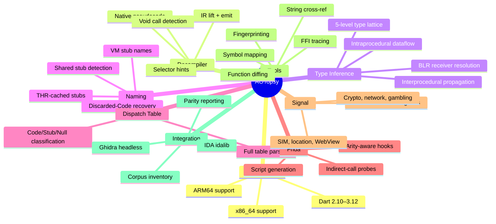

# Changelog

## Feature Overview

## Features

- **Dual-architecture support** — ARM64 and x86_64, sharing the same snapshot parser front half with separate disassembly backends
- **Dart 2.10–3.12 coverage** — Version-specific layouts verified against `dart-lang/sdk` source at each version tag
- **Native decompiler** — `decompile-native` produces readable pseudocode without Ghidra/IDA, for both architectures
- **Whole-program type inference** — `internal/typetrack` resolves BLR receiver types via intraprocedural dataflow + interprocedural propagation
- **Dispatch table parsing** — Full `DispatchTable` decode with entry classification (Code/Stub/Null)
- **THR-cached stub resolution** — Thread-relative indirect calls resolved to real names using ground-truth offsets from `runtime_offsets_extracted.h`
- **VM stub naming** — VM isolate's stub Code objects named by `VM_STUB_CODE_LIST` creation order
- **Discarded-Code function naming** — Functions whose Code object was discarded are name-recoverable via `Function.CodeIndex`
- **Frida script generation** — `--gen-frida` emits hooks for runtime verification of static analysis results
- **Signal classification** — 15+ behavioral categories: crypto, network, gambling, SIM, location, WebView, blockchain, attribution
- **String cross-referencing** — `_debug strings --find <substring> --xref` finds which functions load a given string
- **FFI call-site tracing** — `_debug ffi-trace` statically finds `dart:ffi` `DynamicLibrary.open`/`.lookup` calls
- **Fingerprinting** — Build-id and Dart/Flutter version marker identification
- **Function diffing** — Function-set diff between two `libapp.so` builds
- **Symbol mapping** — Stripped-vs-unstripped call/branch-target resolution
- **Ghidra/IDA integration** — Headless decompilation with metadata injection (ARM64 only)
- **Corpus tools** — `inventory`, `parity`, batch `find-libapp`, `dart2-buckets`, `thr-audit`/`thr-cluster`/`thr-classify`

## Bug Fixes

- `Code.OwnerRef` x86_64 unreliability fixed project-wide (CodeIndex-based resolution preferred)
- Dispatch table indexing off-by-one (1-based for Dart >=2.16, 0-based for <=2.15)
- Signal classification false positives removed (RefCID check against OneByteString/TwoByteString before quoting)
- x86_64 signal graph edge mapping (call/call_indirect vs bl/blr)
- Dart 2.12.0 string extraction (0 to 8,529 isolate strings)
- Compressed pointer load tracking (BLR resolution 2x improvement)
- `STUR` imm9, `STP`/`LDP` imm7, qualified name lookup fixes
- Memory layout overlap at large sample scale (`UC_ERR_MAP` fix)
- `DetectVersion` returns a copy to prevent data races
- `ParseDispatchTable` caps length against `len(data)*8` to prevent OOM on malformed data
- `ResolveStubRanges` caps `FirstEntryWithCode` at `len(table.Entries)` to prevent panic
- `find-libapp` temp path bug (hardcoded relative `./scratch` → `os.CreateTemp("")`)
- `B.cond` bit mask in typetrack (0x7FFFFF → 0x7FFFF, 23 bits → 19 bits)
- `meetType` preserves `KnownStub` when both stubs are identical
- x86_64 typetrack completeness: stack tracking, field lookup, LEA dispatch, allocation stub detection
- `knownVoidSelectors` removed non-void entries (`IOSink.write()` returns `Future`)

## Code Quality

- `.golangci.yml` lint configuration
- `errcheck`, `gofmt`, `goimports`, `gosec`, `staticcheck` findings resolved
- Dead code removed, package doc comments added
- `internal/strutil` shared package replaces three duplicated string-sanitization implementations
- Regression tests use environment variable lookups (`AOTOPSY_TEST_SAMPLE_*`) instead of hardcoded paths
- `NOTICE` file for Dart SDK derived-data attribution (BSD-3-Clause compatibility)
