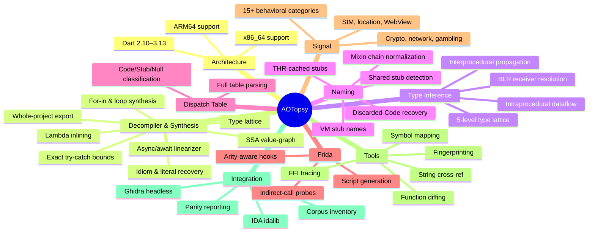

# Changelog

All notable changes to this project will be documented in this file.

The format is based on [Keep a Changelog](https://keepachangelog.com/en/1.1.0/),
and this project adheres to [Semantic Versioning](https://semver.org/spec/v2.0.0.html).

## [Unreleased]

### Fixed
- **A stale compare no longer narrows a rewritten register (ARM64).** `CMP W1,#c;
  <flag-preserving instruction that rewrites X1>; B.EQ` narrowed the NEW value of
  X1, because the edge narrowing reads the block-exit state. The compare is now
  dropped as soon as an instruction writes the compared register. Golden outputs
  are unchanged (no site on the four golden samples hit it).
- **String-interpolation idiom no longer invents operands.** `_StringBase._interpolate`
  takes ONE `List` argument and `_interpolateSingle` takes one `Object?` in all 23
  supported SDKs (`string_patch.dart`; `kernel_to_il.cc` emits `argument_count = 1`),
  so the parts are the array's element stores, not the call's comma-separated
  arguments. The idiom now rewrites only `_interpolate([...list literal...])` and
  `_interpolateSingle(x)` and leaves multi-argument calls alone (it used to print
  `"$null$accumulator$local_m16"`). The non-existent `_StringBase.concat` rewrite
  was removed (string `+` is an operator method).
- **Decompiler output: literals and redundant masks.** String/`null`/`true`/`false`
  literals are no longer printed as `"x" & 0xffffffff`; a mask is not applied on top
  of an expression already masked at least as narrowly; x64 `R8L..R15L` (Go syntax's
  32-bit view) are aliased to their 64-bit register (they used to be treated as
  separate registers and leaked as `r11l`). Elided stack-overflow / write-barrier stub
  blocks are no longer reported as orphans. Ground-truth gate, 3.9.2 arm64/x64:
  masked literals 140/129 -> 2/2, double masks 6/58 -> 0, literal recall x64
  45.2% -> 52.4%; x64 `orphan_block` rose 111 -> 143 (box/Smi diamonds now reach the
  walker's depth budget; recorded in the floor comment).
- **Indirect-call candidates no longer merge unrelated selectors.** The dispatch
  table packs selector rows by row displacement, so slot `selector_offset + cid`
  of a class a selector does not implement usually holds another selector's
  entry. Candidate scans now accept a slot only when its Code's declaring class
  is the receiver class or one of its superclasses and its selector leaf is the
  row's leaf (`typetrack/selector_rows.go`); selector immediates per method name
  are inferred from the rows instead of `slot - ownerCID`. On a real 3.9.2 app a
  Map-literal call had 576 "targets" of unrelated names; polymorphic sites with
  mixed leaves went from 2780 to 0 and the largest set is a real row (~170).
  `selector_dispatch_xref.jsonl` now has one entry per row instead of per slot.
- **Default run exceeded the 2.5 GB address-space budget.** `internal/signal`
  imported `net` (only for `ParseIP`), which linked cgo and glibc's per-thread
  malloc arenas (~1 GB of address space); it uses `net/netip` now and
  `TestCommandDoesNotLinkNetOrCgo` guards the binary.
- **Per-file fsync made large runs 3-4x slower.** Staged artifact writes defer
  fsync to the directory transaction, whose commit syncs files with a worker pool.
- **`platform_channels.jsonl` finds the framework's `const MethodChannel` /
  `EventChannel` / `BasicMessageChannel` instances** (exact evidence,
  `confidence: high`, `const_instances`) in addition to the string+call join.
  Record schema: `channel_name`, `channel_types[]`, `call_sites[]`,
  `const_instances`, `confidence`.
- Full-AOT closure calls are labelled `object_field(Closure.entry_point)` by exact
  SDK shape (arm64 `LDR X2,[X0,#d]; BLR X2`, x64 `MOV RCX,[RAX+d]; CALL RCX`;
  displacement derived from `runtime_offsets_extracted.h`, 2.14.0..3.13.0)
  instead of raw `object_field+N` guesses.
- JSONL writer and reader limits are one 1 GiB / 10M-row budget (a 129k-function
  app writes ~340 MB of evidence); `signal_graph.json` may be up to 1 GiB when
  `meta` reads it.

### Changed
- **Decompiler binds stack-passed call arguments to the call (3.0.5+).** From 3.0.5 the
  compiler writes every stack argument with a `MoveArgumentInstr` inserted immediately before the
  call (`FlowGraph::InsertMoveArguments`; il_arm64.cc / il_x64.cc), to the pre-reserved
  outgoing area at `[SP + index*8]`, with the LAST stack argument at `SP+0`
  (`dart_calling_conventions.cc ComputeCallingConvention`). The SP-relative slots written since
  the previous call are therefore exactly the call's stack arguments, so they are now printed as
  its argument list (deepest slot first) and the redundant `stack_sp = ...` statements are
  removed. Only for a contiguous run `SP+0..SP+8(k-1)`, never for VM stub callees. In 3.0.5..3.3.x
  (no register calling convention: `dart_calling_conventions.cc` first exists at 3.4.3) the
  stack arguments are the whole list; from 3.4 they follow the register arguments. 3.9.2, first
  3000 functions: stack-slot statements arm64 2679 -> 155, x64 3256 -> 699; ground-truth gate
  `stack_sp_leak` 140/142 -> 0/2.
- **Decompiler names switchable (instance) calls: `recv.name(args)` instead of
  `dynamicCall(dispatchTarget, ...)`.** `FlowGraphCompiler::EmitInstanceCallAOT` (read at x64
  2.10.0 / 2.12.0 / 3.9.2 / 3.13.0; arm64 per the audit) loads the receiver from
  `[SP + (SizeWithoutTypeArgs-1)*8]` (R0 / RDX), the UnlinkedCall into IC_DATA_REG (R5 / RBX) and
  the SwitchableCallMiss stub into LR / RCX, then calls. The UnlinkedCall's `target_name` is the
  selector (`dyn:` prefix = dynamic-invocation forwarder, `Symbols::DynamicPrefix` in every
  version). The call is recognised from the register pair {IC_DATA_REG, LR} of the LDP (arm64; the
  pool-slot ORDER flips at 3.10.7 but the registers do not) or the RBX pool load (x64), and printed
  only when the receiver is exactly the first bound stack argument (so type-argument vectors and
  unbound slots are left as before). Getters/setters/operators/`[]` print as such. Also: an
  `ldr/ldp reg, [x]` with no displacement whose base holds `PP+N` now resolves to pool element N.
  Measured on the first 3000 functions: `dynamicCall(` 357 -> 348 (3.9.2 arm64), 401 -> 392 (3.9.2
  x64), 472 -> 450 (2.12.0 arm64). The ceiling is low by construction: switchable calls are only
  189 call sites in the whole 2.12.0 sample (3734 BLRs are dispatch-table calls, which already
  carry their selector).
  **Second step (this replaces the display-based recogniser above):** the call is now identified by
  the OBJECT in IC_DATA_REG, not by how its pool entry prints. `cluster` captures the
  CallSiteData refs of every `UnlinkedCall` and `MegamorphicCache` (`Result.CallSites`;
  `EmitMegamorphicInstanceCall`, which is the 2.x AOT form of the same call, loads a
  MegamorphicCache with the identical `LDP {R5, LR}` -- 139 of the 189 call sites of the 2.12.0
  sample), `cluster.ArgsDescriptorDecoder` decodes `args_descriptor`, and the decompiler gets
  selector + exact argument count + named arguments through `FuncIR.CallSiteAt`. The call is
  rendered only when the bound stack arguments are exactly the descriptor's count (plus the
  type-argument vector when `type_args_len > 0`), and named arguments print as `name: value`.
  The descriptor's argument count equals the receiver slot `[SP+(count-1)*8]` at **every** one of
  the ~520 switchable sites of the 21 arm64 corpus samples (0 mismatches;
  `TestSwitchableReceiverSlotMatchesArgumentsDescriptor`). Descriptors are decoded two ways, both
  read from the SDK at every md5 bucket: the VM's pre-allocated `cached_args_descriptors_`
  (`Serializer::AddBaseObjects` hands them the first reference ids, in order: first id 25 on
  2.10.0, 19 on 2.12..2.17.6, 20 on 2.18/2.19, 21 on 3.0.5/3.1.0, 22 on 3.2.5..3.4.3, 21 on
  3.5.0..3.12.2; 32 entries, plus 3 type-argument entries from 3.9.2) and, because 3.13.0 no
  longer adds them as base objects (AOT base objects are the 7 Roots), real Arrays of Smi
  objects (`Result.MintValues`). 2.12.0 arm64, first 3000 functions: `dynamicCall(` 472 -> 398.
- **A receiver's class bound now selects the dispatch-table row (selector-only calls).** For a
  selector-only dispatch (`SUB X, cid, #imm; LDR X30,[DT, X, LSL #3]; BLR`) the callee is the
  slot `imm + cid(receiver)`. When the receiver object is a `ClassBound(C)` (declared parameter /
  field / return types, the owner of an instance method), its runtime classes are the classes that
  extend or implement C (`ClassHierarchy`, proven on the corpus above; Null always kept), and the
  row leaf is now elected among THOSE classes' slots instead of among every class. That is the
  fix, not just a narrowing: row displacement packs rows into each other's holes, so the global
  vote let whichever selector owned the most slots in the region win -- on 3.9.2 a `String`-typed
  receiver's call was reported as `PointerEvent.get:pointer`, `Element.inflateWidget` as
  `Object.==`, `_AsyncStarStreamController.add` as `PointerEvent.get:pointer`. The receiver's own
  slot is in the selector's row by construction (`SelectorRow::FillTable` writes `offset + cid`
  for every concrete subclass interval), which is why electing among the receiver's classes is
  sound; an empty bounded answer, an unknown bound or a hierarchy with an unresolved edge fall back
  to the unbounded scan. Lattice: `SelectorDispatch(imm, recvBound)`, joins drop a disagreeing bound
  and keep the selector. Per-record effect on the golden samples (arm64; the x86_64 path is
  unchanged, see below): 3.9.2 88 records, 2.12.0 63, 3.13.0 81, no record added or removed, only
  `target/targets/candidates` change, e.g. `Element.updateChildren: Object.== ->
  Element.inflateWidget`, `RenderBox.performResize: Object.get:runtimeType ->
  RenderBox.get:constraints`, `NavigatorState.activate: 34 get:iterator candidates -> 9, all List
  types`. Monomorphic sites -27/-19/-34 are wrong single answers that became honest candidate sets.
  Not done: x86_64 still takes the unbounded prescan path (separate transfer function, no
  `SelectorDispatch` lattice there).
- **Class hierarchy capture (P1 of the type-test work): `implements` edges and the abstract
  bit.** `readFillClass` read and discarded `UntaggedClass::interfaces` and `state_bits`; both
  are now kept (`ClassInfo.InterfacesRefID`, `StateBits`, `IsAbstract()`), and
  `cluster.NewClassHierarchy` merges isolate + VM snapshot into `extends`/`implements` edges
  plus the abstract flag. SDK facts read per version: `interfaces` is the field four slots
  before `super_type` in every layout (index 5 on 13 refs, 6 on 15/16; `raw_object.h`
  UntaggedClass at 2.12.0, 2.14.0, 3.9.2, 3.13.0); the abstract bit is bit 6 of `state_bits_`
  (`Const 0, Implemented 1, ClassFinalized 2..3, ClassLoading 4..5, Abstract 6`) in every
  version (object.h `Class::StateBits` through 3.5.0, the BitField chain from 3.6.2, md5-identical
  3.6.2..3.13.0); mixins need no field (kernel_loader.cc skips `kMixinType`; a transformed
  mixin application `S&M` has the mixin among its `interfaces`, `ASSERT(interface_count > 0)`).
  Proven on the corpus, not assumed: on all 24 arm64 samples every super/interface ref resolves
  to a class (0 unresolved), `_OneByteString <: String <: Comparable`,
  `_GrowableList <: List <: Iterable`, `_Smi/_Double <: num` hold and `List`/`Iterable` are
  abstract while `_GrowableList`/`_OneByteString` are not (`TestClassHierarchyOnCorpus`; the
  first version of that test was vacuous -- library-mangled names `_Smi@0150898` -- and the
  non-vacuity guard caught it). Pure capture: no output changes.
- **VM stub Code objects in the pool were named from the wrong end of the stub list (all
  versions).** `BuildPoolLookups` zipped `vmResult.Codes[i]` against the stub list in
  `StubCode::Init` emission order, but an AOT Code cluster is written in IMAGE order
  (`CodeSerializationCluster::WriteAlloc` sorts by instructions id, `CompareCodeOrderInfo`;
  the image is the reverse of the emission order). Evidence in the corpus, not inference: on the
  `-gt-` builds 2.13.0..2.16.0 the `Precompiled_Stub_*` ELF symbols in ascending address order are
  exactly the image-order table (`TestVMStubOrderMatchesSymbolTable`), and on 2.10.0..2.14.0 the
  stub slot paired with an UnlinkedCall must be `SwitchableCallMiss` / with a MegamorphicCache
  `MegamorphicCall` (`TestVMStubPairSlotsAreNamedByTheirStub`: it displayed `NotLoaded` /
  `Subtype5TestCache` before, proven failing on a clean HEAD worktree). The emission-order
  function `VMStubNamesInClusterOrder` is deleted; `VMStubNamesInImageOrder` is the single list.
  Per-record effect (call_edges only `target`/`via` change, no record added or removed): 3.9.2
  arm64 426 edges, 3.12.2 x64 405, 2.12.0 arm64 754, e.g. 114x `AllocateInt32Array` ->
  `InstantiateTypeArguments`, 111x `AllocateFloat32x4Array` -> `InstanceOf`, 20x
  `OptimizedIdenticalWithNumberCheck` (`===`), the JIT-only `*Breakpoint`/`*InlineCache` stubs
  that cannot occur in AOT are gone; 2.12.0: 225x `FrameAwaitingMaterialization` ->
  `CallBootstrapNative`. 3.13.0 has no VM snapshot and is unaffected.
- **Typetrack resolves switchable calls by the UnlinkedCall/MegamorphicCache selector.** There
  was no handler for the pool-pair `LDP R5, LR, [PP + n]` at all: LR kept the *stub* slot, whose
  display is a pool-name artifact, so 150 call edges of the 2.12.0 sample were recorded with the
  bogus target `Subtype5TestCache` (139) or `TopTypeTypeTest` (11). `handlePPLoad` now types both
  words of the pair (and accumulates `ADD X16, PP, #hi, LSL #12; ADD X16, X16, #lo`, the form
  LoadDoubleWordFromPoolIndex uses past the LDP range), and the BLR through LR takes the
  call-site fact. x64 gets the same for `call RCX` after `RBX <- UnlinkedCall`. A `dyn:foo`
  call resolves by `foo` (`Resolver::ResolveDynamic*` demangles it before the lookup; same logic
  at 2.12.0 and 3.9.2, `DemangleDynamicInvocationForwarderName` in every supported version).
  Per-record golden deltas (all explained, none unexplained): 2.12.0 arm64 150 records bogus
  target -> real candidate sets (140 polymorphic, 10 single), no record added or removed;
  3.9.2 / 3.13.0 arm64 and 3.12.2 x64 +3 previously unresolved `dyn:` sites each. MegamorphicCache
  objects are now named by their selector (`NameIdx 0`, as UnlinkedCall): corpus `named`
  +3/+4 on 2.10.0/2.12.0, asm annotations `<MegamorphicCache>` -> selector (139 lines).
  *Open, separate defect found on the way:* the stub slot of these pairs displays as a wrong stub
  name on 2.12.0 (`Subtype5TestCache` for MegamorphicCall) -- a stub-name table problem, see
  `.tmp/review/SESSION-LOG-2026-10.md`.
- **Decompiler binds pushed call arguments to the call (<= 2.19.0).** Before 3.0.5 arguments are
  pushed (`PushArgumentInstr`) and the caller drops them after the call (`Drop(argc)`), so the
  argument count is the stack-pointer adjustment right after the call (`ADD X15,X15,#8*argc` /
  `ADD RSP,8*argc`). The lifter now records pushes (`str/stp [x15,#-N]!`, x64 `push`) in push
  order (`ArgumentsPusher` uses `PushPair(reg, pending)`: in `STP Xa,Xb` Xb is the EARLIER
  argument), and the call takes the last `argc` of them and removes their `push(...)`
  statements. Never for VM stub callees, never when the next instruction is not the drop.
  2.12.0 arm64, first 3000 functions: stack-slot statements 11329 -> 1215, calls with arguments
  1570 -> 2816.
- **Lifter: an instruction with no handler no longer leaves its destination's old value in place.**
  `ApplyOther` silently skipped unknown mnemonics, so a register written by e.g. `SBFIZ` kept the
  value from BEFORE the instruction and later reads printed it (`describeConfig` showed
  `"$name v$name"` instead of the version). Unhandled destinations are now dropped, and `SBFX`/
  `SBFIZ` with `#1` (SmiUntag/SmiTag, `kSmiTagSize = 1`) are modelled (`x >> 1`, `x << 1`).
  `raw_register` on the arm64 ground truth 42 -> 49 (unknown values show as the register).
- **The "rejoin-only else" collapse is limited to Smi tests.** `if (c) { L: X } else { goto L }`
  is only value-preserving for a bit-0 test (`>> 0 & 1`), where both paths hold the same value;
  for any other condition (e.g. `enabled ? "on" : "off"`) the structured walk prints the join
  under one path's register state, so the condition is the only hint left and must stay.
- **Decompiler no longer lists write-barrier / stack-overflow stub blocks as lost code, and
  straight-line continuations no longer consume nesting depth.** The barrier-check block can be
  emitted as a helper after the orphan scan runs, so its stub path was not yet marked as elided
  and showed up as `// orphan block N` (with a `goto` to it left behind). An unreached block that
  is only a call to a `*WriteBarrier` / `StackOverflowStub*` symbol is now accounted for. Also,
  a fallthrough, unconditional jump or elided-branch edge opens no construct, so it no longer
  counts against `maxDepth` (that bounds nesting, not function length). 3.9.2 ground-truth gate:
  `orphan_block` 107/143 -> 11/47 and `goto_block` 127/133 -> 32/38 (arm64/x64); first 3000
  functions: orphan blocks arm64 423 -> 157, x64 3797 (before the decompiler series) -> 2400.
- **x86-64 alignment padding is no longer reported as an orphan block.** A function's code
  range is padded with `int3` (0xCC) to its alignment; the tail after the final `jmp`
  decoded as a block of its own with no predecessor and was listed as lost code. That was
  91% of all x64 orphans (2180 of 2400 in the first 3000 functions of the 3.9.2 sample).
  An unreachable block made only of `int3`/`nop` is now accounted for. The barrier /
  stack-overflow stub recogniser also resolves calls made through the Thread stub table
  (`call [r14+disp]`, `ldr x30,[THR,#off]; blr x30`). First 3000 functions: x64 orphan blocks
  2400 -> 166 (arm64 stays at 157: those are the bodies of the WriteBarrier wrapper stubs
  themselves, which are real code); ground-truth gate x64 `orphan_block` 47 -> 10.
- **Decompiler rebuilds string templates from the interpolation array.** A Dart
  interpolation compiles to `CreateArray(n)` + one `StoreIndexed` per piece +
  `_StringBase._interpolate(list)` (one argument; `kernel_binary_flowgraph.cc`
  `BuildStringConcatenation`), and an Array's element `i` sits at tagged offset
  `f23 + 8*i` (uncompressed) or `f15 + 4*i` (compressed >= 2.14.0)
  (`runtime_offsets_extracted.h` `Array_data_offset` 24 / 16). A new statement-tree
  pass folds the three shapes real output shows (array temp, array pushed inline,
  array copied to a frame slot that the call overwrites) into `"..$x..${e}"`, only when
  the element indices are exactly 0..n-1, no construct sits between allocation and call,
  and every piece survives being evaluated at the call (a call-valued piece may not be
  reordered past any statement, a memory read may not cross a call or store, a local may
  not be reassigned). A bare `$ident` followed by an identifier character is written
  `${ident}`. A second rule collapses `if (c) { L: X } else { goto L }` when `c` contains
  no call (what an array store's Smi/barrier check leaves once the stub is elided).
  First 3000 functions of the 3.9.2 sample: remaining `_interpolate(` calls 253 -> 190
  (arm64), 255 -> 189 (x64); template strings 6/0 -> 54/56. Ground-truth gate: `goto_block`
  249/257 -> 127/133. The shared call regex now also matches empty-argument calls
  (`_interpolate()`), the dominant real shape.
- **Decompiler collapses BoxInt64 Smi-or-Mint diamonds.** `BoxInt64Instr::EmitNativeCode`
  (read and diffed in all 23 SDK trees) tags the value when it fits a Smi and otherwise
  allocates a Mint and stores the value; both paths continue at the same label and hold
  the same Dart int. The emitter showed this as a nested `if/else` whose miss branch is only
  the `Allocate...Mint...` stub call plus a `goto`. A new statement-tree pass removes the
  diamond when (and only when) the miss branch contains nothing else. 3.9.2 ground-truth gate:
  `goto_block` 277/285 -> 249/257 (arm64/x64), x64 `const_masked` 29 -> 1. `orphan_block`
  is unchanged: orphans are decided by the walk's depth budget before this pass runs.
- **Removed two unfounded annotations.** The `// null-safety: nullable variables`
  comment (a `== null` compare does not prove a nullable type: the compiler emits
  null compares for caller-side assert-assignable checks, `??`/`?.` lowering and
  defensive checks) and the integer-literal guess in `// local types` (a bare integer
  may be a raw machine immediate, not a Dart int). String/bool/double literals and
  declared/IR types are still annotated.
- **Parameters keep neutral `argN` names.** The type-derived renaming (`str0`,
  `n1`, `flag2`, `callback3`) invented roles: positional parameter names are not in
  a Full-AOT snapshot in any supported version (>=2.14.0 does not serialize them;
  2.10.0..2.13.0 overwrite them with `<optimized out>`, measured on four samples
  and traced to `ProgramVisitor::PrepareParameterNames`). The declared type is
  still shown in the signature.
- **Removed the usage-count temp renaming from the decompiler.** The pass that
  renamed temps to `result`/`flag`/`counter`/`accumulator` from occurrence counts
  asserted roles the binary does not have, and its choice changed after unrelated
  edits (a `StringBuffer.writeln()` result was printed as `counter`, then as
  `accumulator`). Temps keep their neutral `tN` names. `compare.ReplaceIdentToken`
  (a one-line wrapper) was deleted in favour of `stmt.ReplaceIdent`.
- **Class-id compares narrow the object they were read from (ARM64).** A class
  id now remembers the register whose header it came from (dropped as soon as
  that register is rewritten); `cmp cid,#c; b.eq`, including the Smi-tagged
  `LSL #1` form, narrows that object to exactly that class on the equal edge.
  `narrow_hits` 0 -> 81 on 3.9.2, `narrow_no_type` 297 -> 216. It does NOT change
  any call resolution (monomorphic and resolved counts are identical); it is
  groundwork. New report counters: `narrow_src_hits`, `sel_recv_bound/top/nolink`
  (only ~4-8% of selector-only dispatch sites have a class-bounded receiver).
- **Decompiler annotates class-id tests.** `classId(x) == N` and unsigned cid
  range tests get a trailing comment naming the classes at the ends of the range.
  It does not claim which type `T` the test implements (the VM's ranges follow
  `implements` and merge across abstract classes).
- **Output layout:** `--graph`, `parity` and `_debug symbolmap` write into
  `<out>/graph`, `<out>/parity` and `<out>/symbolmap` instead of replacing `<out>`.
  `_debug render` no longer writes `reachable.dot/svg` (the structural closure from
  all source SCCs covered every function by construction) and `--cfg` takes
  `--cfg-max` (default 500). `export-dart --max` defaults to 0 (unlimited).
- Snapshots whose features string targets another architecture/OS than the ELF
  (or an unsupported OS) are rejected; `knownHashes` lost the 18 entries that no SDK
  tag reproduces and regained the Dart 3.0.0-3.0.2 hash.
- Ghidra/IDA integrations publish only after a completion sentinel
  (`.aotopsy-apply-ok` / `.aotopsy-apply-failed`) validated against the staged
  `.c` files; IDA works on a private copy and never touches the input directory.
- `typetrack` no longer uses observed const-instance field types or RTA filtering
  (the Full-AOT snapshot carries only declared field types: `guarded_cid` /
  exactness are written only for non-AOT kinds in every supported SDK).
- **`_debug fingerprint` now has a source-bounded report contract and accepts
  only supported Dart AOT ELF inputs.** The JSON report no longer exposes the
  old `flutter_version`, generic `confidence`, or `exec_section_size` fields.
  It now separates exact file/build/snapshot identities from heuristic Dart
  `Version::String()` evidence with fields such as `file_sha256`, `elf_class`,
  `snapshot_hash`, `version_evidence`, `version_confidence`,
  `mapped_executable_size`, and explicit evidence limitations/conflicts.
  Flutter marker text is diagnostic only and is not promoted to Dart-version
  evidence. The command now uses the same validated ELF reader as the analyzer,
  so its input scope is ELF64 little-endian ET_DYN AArch64/x86-64 rather than an
  arbitrary ELF file. External consumers of the previous fingerprint JSON
  schema must update their field names and confidence handling.

### Removed
- **Function fingerprint dictionary (cross-sample name transfer).** The feature
  existed and has been removed entirely: the `build-fingerprint-dict` and
  `apply-fingerprint-dict` commands, the `function_fingerprints.jsonl` artifact,
  `Opts.FingerprintDictionary`, and the `compare.FunctionDictionary` /
  `CrossSampleDictionary` library. Its idea was to hash each function's
  instruction bytes in a binary whose names are known and propose those names
  for the same bytes in a stripped or obfuscated binary of the same Dart
  version and architecture. A byte hash is not proof of a name (the same
  instructions can read different object-pool contents, and small functions
  collide), the dictionary stopped being applied to names, and nothing in the
  CLI consumed it any more. History, for anyone who wants to bring it back
  (`git show <commit>:<path>`):
  - `c164512` (2026-08-19, #7) added the library
    (`internal/decompiler/compare/fingerprint_dict.go`, `cross_sample.go`) and
    the `function_fingerprints.jsonl` writer
    (`internal/analysis/r2_fingerprint_export.go`).
  - `0fdbf49` (2026-09-02, #13) added the CLI commands
    (`cmd/aotopsy/cmd_fingerprint_dict.go`). Last release that has it: v1.6.0.
  - `498c0b2` (2026-09-29) added the pipeline hook
    (`internal/analysis/fingerprint_dictionary.go`) that applied dictionary
    names to unnamed functions.
  - `0c80f93` (2026-10-01) stopped applying names: the hook only counted
    heuristic matches and logged them.
  - `b66f5ed` removed it (2026-10-01). Restore with
    `git show b66f5ed^:<path>`.

  Any user of `function_fingerprints.jsonl` or the two commands must stay on
  v1.6.0 or earlier, or recompute hashes themselves. The golden records no
  longer list `function_fingerprints.jsonl`.

## [1.6.0] - 2026-09-09

The Ghidra and IDA integration was documented, wired into the CLI, and read by
the runtime — and absent from the repository. A clean clone had none of the
three Python scripts, so `make install` died on a glob that expanded to
nothing, and no release archive ever carried them. The theme of this release is
that an asset the code depends on is not optional, and that discovering this
required installing from a clean export rather than from a working tree that
had the files untracked.

### Fixed
- **`make install` failed on a clean checkout** at
  `install -m 644 ghidra_scripts/*.py`, reported as issue #17. The Makefile was
  not wrong about the paths; the files were not in the repository. Line 67 of
  `.gitignore` read `aotopsy_*` — unanchored, so it matched
  `ghidra_scripts/aotopsy_prescript.py`, `ghidra_scripts/aotopsy_apply.py` and
  `ida_scripts/aotopsy_apply.py` along with the root-level build binaries it
  was written for. Anyone who had the scripts had them untracked, which is why
  the gap only appeared from a fresh clone. The pattern is now `/aotopsy_*`:
  root binaries stay ignored, the subdirectory scripts are tracked.
- **The `install` target globbed instead of naming its inputs.** A missing file
  produced `cannot stat 'ghidra_scripts/*.py'` rather than its own name, and
  fixing only the Ghidra line would have moved the same failure to the IDA
  line. Assets are now listed explicitly and are prerequisites of the target.
  `AARCH64_dart.cspec` is installed as well — it was tracked but silently
  dropped by a `*.py` glob.
- **Release archives carried no integration assets.** The v1.5.0 tarballs held
  the binary and five markdown files, while script discovery looks for
  `ghidra_scripts/` and `ida_scripts/` beside the executable. `aotopsy ghidra`
  and `aotopsy ida` therefore could not work from a release download at all.
  GoReleaser now archives the same four files `make install` installs.

### Changed
- **The artifact copy is now the script that runs.** `CopyGhidraArtifacts` and
  `CopyIDAArtifacts` return the paths they wrote, and the `ghidra` and `ida`
  commands execute those. Both previously copied the scripts into the output
  directory and then ran the *install* location anyway — IDA unconditionally,
  the Ghidra GUI path by re-running discovery — so an artifact reused with
  `--from` was never portable. A copy failure was a warning that left the
  caller pointing at an empty directory; it is fatal now.

### Added
- Asset contract coverage in `internal/analysis/integration_assets_test.go`:
  the four assets exist and are non-empty, discovery resolves them from the
  `$HOME/.aotopsy/` layout `make install` produces, a directory holding only
  one of the two Ghidra scripts is rejected, the copies match their sources,
  and missing assets surface as an error rather than an empty output directory.

## [1.5.0] - 2026-09-06

Name recovery from the snapshot's own tables, and a round of fabrications
removed. The theme of the release is that several things the decompiler stated
confidently were not recovered at all — invented loops, invented switch cases,
invented call arguments — and that a corpus of 93 binaries was being checked
400 functions at a time, which is where they were hiding.

### Fixed
- **An unresolved x86_64 pool load left the destination register carrying its
  previous provenance.** Removing the fabricated `pp[0]` fallback took the
  `else` branch away entirely, so `mov reg, [PP+disp]` with a displacement that
  names no pool slot neither defined nor killed `reg`. The block then reported
  itself as transparent for that register, and the reaching-definitions fixpoint
  carried the note from *before* the load straight through — a stale claim
  attributed to an instruction that had overwritten it. The load now kills the
  register: an unresolved slot is unknown, not zero and not whatever was there a
  moment ago. Measured 0 of 47,172 pool loads across three x64 samples reach this
  path, so nothing observable changes today; it is a correctness hole, not an
  active defect.
- **The same hole in type inference.** `handleX86Load` returned early on an
  unresolvable pool index without touching the destination's type, so a
  `KnownClass` survived a load it did not survive. `KnownClass` is authoritative
  downstream — it selects dispatch targets. The destination is now `Top`.
- **A conditional jump with an unresolvable target no longer swallows the branch.**
  The unified block partitioner classified it `FlowNormal`, so no leader was
  placed after it and the block did not end — quieter than the pre-unification
  partitioner, which split and emitted the fallthrough edge alone. Unreachable on
  the corpus (0 of 120,814 conditional jumps; every x86-64 Jcc carries a
  rel8/rel32), fixed because a silently merged basic block is expensive to notice.
- **`NO_COLOR` now beats `CLICOLOR_FORCE`.** Detection checked force first, so
  `NO_COLOR=1 CLICOLOR_FORCE=1` emitted escapes at a user who had opted out.
  Ordering matched against `muesli/termenv`, whose `EnvNoColor` documents that
  `NO_COLOR` is honoured "ignoring CLICOLOR/CLICOLOR_FORCE". `CLICOLOR=0` remains
  the weaker request and still yields to force, and a forced run on `TERM=dumb`
  gets plain 16-colour ANSI rather than nothing.
- **`--graph` draws call targets in per-function CFGs again.** Routing the
  renderer from `internal/callgraph` to `internal/render` dropped them: the old
  renderer read `BasicBlock.Calls`, and `disasm.BasicBlock` has no such field. The
  CFG showed where a block branched but no longer what it called.
- **The decompiler wrapped straight-line code in `while (true)` in 40–46% of
  functions.** The back-edge test compared block addresses, which is a backward
  *jump* in the code layout, not a back *edge*. Dart AOT emits two backward
  jumps that are not loops and are everywhere: the stack-overflow slow path
  placed at the end of the function, and the monomorphic entry check that jumps
  back on a cid miss (present in every `dyn:` forwarder and most constructors).
  Replaced with the definition that excludes both without knowing about either
  — `u → v` is a back edge exactly when `v` dominates `u` — on a new dominator
  analysis. Functions with a loop per 400: 186→54, 182→43, 168→47, 65→4.
- **Switch recovery was ARM64-only, and on ARM64 it invented its answer.** It
  took every block after the indirect jump, in address order, and labelled them
  case 0, 1, 2 … up to 64, without ever reading the jump table. The real targets
  are in `IndirectGotoInstr`'s `offsets_`, a `TypedDataInt32Array` in the object
  pool holding one byte offset per case from the Code's entry. Validated before
  implementing: every offset lands exactly on a block start, on both
  architectures and including 2.12.0's older instruction shape.
- **A two-block, 896-byte function emitted ~570 MB of source and took the
  process out of memory at 5.9 GB.** Register values are held as expression
  *text* and arithmetic emits no statement of its own, so an instruction that
  reads a register three times triples the stored string — and Dart's hash
  combiner does exactly that, twenty times over in `SystemHash.hash20`. Over-long
  expressions now materialise into a named temporary, which turns exponential
  growth into linear. `maxStepsPerEmitter` could not see it: the step count is
  tiny, the blowup is in string length.
- **A pointer store was rendered as a rebinding.** `str x1, [x0]` writes to the
  memory *at* the address in x0; it does not rebind the variable holding it. The
  displaced form `[x0, #0]` — the identical machine operation — already rendered
  correctly as a field store, so one operation had two renderings and one of them
  stated something else.
- **Two distinct variables could be renamed into one.** The semantic-rename pass
  checked whether its target name already existed in the source but never whether
  another rename in the same pass had claimed it, so two temps classifying the
  same way both became `accumulator`. The invalid Dart was the symptom; the
  defect is an identity the binary does not have. Fixed with the missing guard
  plus a deterministic ordering, without which map iteration order would decide
  the winner.
- **`ValidateSource` reported invalid syntax in comments.** The syntax rules ran
  against whole raw lines while only brace-counting was comment-aware, so
  inlined-frame markers — which contain a constructor name ending in a dot —
  failed 55 valid functions on one sample. A gate that cries wolf hides things:
  the pointer-store defect above was invisible until this was fixed.
- **Indirect calls were shown with a register dump for an argument list.** An
  AOT switchable call passes its arguments on the stack; the argument registers
  at such a site hold whatever surrounding code left in them, and the register at
  argument index 3 is `IC_DATA_REG` on both architectures. x86_64 suffered far
  more than ARM64 because its receiver lands in RDX — argument index 2 — while
  ARM64's lands in R0, which is not an argument register at all.

### Changed
- **One implementation of function slicing.** The `PCOffset - CodeOff` / clamp /
  add-CodeVA arithmetic was written out by hand at nineteen call sites across six
  packages; it now lives once in `cluster.CodeImage`, which `analysis.CodeImage`
  embeds and extends with naming. Sites that only needed a virtual address
  previously skipped both the clamp and the underflow check, so a range beginning
  before the image produced an address near 2^64 instead of being rejected.
  `SliceExact` is the all-or-nothing variant for content hashing, where a clamped
  read would digest something that is not the function.
- **One symbol-name builder.** `LoadContext`, `RunDisasmStage` and
  `RunDisasmStageX86` each built their own, with comments pointing at each other.
  Teaching one about isolate stubs left the other two emitting `sub_<pcOffset>`
  into `call_edges.jsonl` and the signal graph, which is how this was found.
- **`PoolLookups.TypeTestingStubNames` is now `TypeNames`, and holds the bare
  type name.** The stub prefix is derived by `TypeTestingStubName`. The name was
  being computed complete with type arguments and then made unusable by the
  prefix, which is why 517 pool entries per binary rendered as `<Type>`.
- **Unresolved indirect jumps are no longer called "switch dispatch".** One
  sample has 45 jump tables in the whole binary against 270 indirect jumps in 400
  functions, so the overwhelming majority are something else. The mechanism is
  named; the construct is not guessed.

### Added
- **JSONL schema gates.** `functions.jsonl`, `call_edges.jsonl`,
  `string_refs.jsonl`, `unresolved_thr.jsonl`, ffi-trace findings and strxref
  references now have tests pinning their exact wire keys and their `omitempty`
  sets. These names are a published interface, and a renamed key fails silently on
  both sides — it decodes to the zero value. That is how `string_refs.jsonl`'s
  caller name reached the Frida exporter as `""`: the writer said `func`, the
  reader asked for `from_func`, and neither complained.
- **A test that reads a `.dot`.** Golden covers the JSONL artifacts only, so the
  graph output had no coverage at all, which is why the CFG regression above went
  unnoticed.
- `analysis.DefaultMaxScan` replaces `ffitrace`'s private copy of the same number.
  After the scan loop moved to `analysis`, that copy survived only in ffitrace's
  test, which therefore asserted against a constant that no longer drove anything.
- **Isolate stub names.** These are the only Codes in an AOT snapshot with no
  owner at all, so the owner walk finds nothing and every one rendered as
  `sub_<pcOffset>` — 639 of 840 unresolved-call tokens on one sample pointed at
  just 85 of them. Their names survive only in the isolate roots section, whose
  `RW(Code, <name>_stub)` fields are now committed per version and gated against
  dart-lang/sdk. `sub_` counts fell 85→9, 86→10 and 54→1.
- **Type-testing-stub naming on every supported version**, generating the VM's
  own spelling alongside so the symtab differential compares like with like
  rather than scoring every stub as a disagreement.
- **GC stack maps**, recovered from the InstructionsTable and shipped as
  `stack_maps.jsonl`.
- **Dispatch-table calls are recognised as such**, with the selector offset
  recovered from the instruction stream on both architectures. The selector's
  *name* is deliberately not recovered: reading the table at `selector + cid` for
  every cid gives 72–152 distinct method names per offset, because the table is
  packed and the neighbouring slots belong to other selectors. The offset is
  reported instead — it is stable, and two sites sharing one call the same
  selector.
- **`TestFullCorpusSweep`** decompiles every function of every sample — 93
  binaries, 786 362 functions — failing on a panic, invalid Dart, or more than
  2 MB of source from one function. It exists because three consecutive rounds of
  defects all lived past function #400, which is where every other decompiler
  check stops looking. Opt-in via `AOTOPSY_SWEEP=1`.

## [1.4.0] - 2026-09-03

The per-version VM tables are now generated from dart-lang/sdk, and every
hand-maintained layer that used to fill the generator's gaps has been deleted
rather than corrected. Each of those layers was wrong in a way that could not
go red — the defects here were in the things meant to be checking the tables,
not in the tables.

### Fixed
- **Runtime-entry names were missing on x86_64.** `mergeRuntimeEntries` listed
  only 14 of the 27 x64 Thread tables, so the rest rendered every runtime-entry
  call site as an unnamed `THR.fNN` — 1015 unnamed entries in total, all x64.
  Both architectures are now covered by construction: `thrV3130_x64` goes from
  31 named entries to 162, and the 3.9.2 x64 table from ~110 to 205.
- **Leaf runtime entries were named as their neighbours.** The hand-typed leaf
  base offsets were one slot high. `runtime_offsets_extracted.h` exports the
  leaf anchor on three versions, and on all three it sits at
  `exit_through_ffi+8` — one slot below where these calls placed it (3.12.2
  used `0x710` against the SDK's `0x708`). Every leaf entry the layer did name
  was therefore shifted by one position.
- **`extract_thr -check-runtime-entries` could not fail.** It printed counts and
  returned 0 unconditionally, under a comment stating the committed tables did
  not exist yet — untrue since v1.3.0's generator work. A gate that cannot go
  red reads exactly like a gate that passes. It now compares every entry in
  `RUNTIME_ENTRY_LIST` and `LEAF_RUNTIME_ENTRY_LIST` against the committed
  tables across all 46 version/arch pairs, and exits 1 on any gap.
- **A second macro parser misread `LEAF_RUNTIME_ENTRY_LIST`.** It took the last
  macro argument — correct for `roots.h`, wrong for the leaf list, whose shape
  is `V(ret, Name, args...)`. It reported the SDK as declaring leaf entries
  named `"uword"` and `"thread"`. The committed tables were fine; the checker
  was the broken half. The parser had no other caller and is gone.
- **`rewriteVarLiterals` wrote without formatting**, unlike `runWrite`. Splicing
  map literals in by byte offset changes key widths, so regenerating put
  `thrfields.go`, `threadstubs.go` and `stubnames.go` into the tree unformatted
  — straight into the CI `gofmt` gate.
- **`xor reg, reg` leaked a register instead of yielding `0`.** The decompiler
  now folds self-operand bitwise ops: `^` on a register with itself is the x86
  zeroing idiom, `&` and `|` are identities. x86_64 register leaks drop from
  247 to 169 (−32%), `rcx` from 61 to 9. ARM64 is unchanged, as expected — it
  zeroes via `xzr`.
- **The Thread field drift gate covered 13 of 23 versions**, silently. It
  re-implemented the SDK header parser and understood only the post-3.0.5
  section-guard shape; a version simply absent from its list looks like a
  passing test. It now delegates to `extract_thr -check`, which handles all 23.

### Changed
- Runtime-entry names are derived inside `extractAll` from anchors the SDK
  exports by name, with three anchor sources tried in order: the exported
  anchor, adjacency to the runtime block (a fact `leafFollowsRuntime` reads
  from `thread.h`, not an assumption about layout), then `exit_through_ffi+8`.
  Because `extractAll` already visits every target, both architectures and all
  variants are covered without anyone remembering to add a call. An offset
  already holding an SDK-exported name is left alone and the disagreement
  reported, so a broken contiguity assumption cannot be papered over.

### Removed
- **The hand-written runtime-entry merge layer** — `internal/vmtables/runtimeentries.go`,
  two `init()` blocks, 16 name tables, `mergeRuntimeEntries`, `runtimeEntryConflicts`
  and their two tests (552 lines). It was a second source of truth for data the
  SDK already answers, and it was the wrong one. `TestNoRuntimeEntryConflicts`,
  added in v1.3.0 as "the only signal" for a wrong base offset, did its job
  immediately: it fired, and what it proved was that the layer it guarded
  should not exist.

## [1.3.0] - 2026-09-02

Correctness release. Most of it is one story: the checks meant to catch
regressions were not running, and once they ran they found real defects.

### Added
- **Corpus-wide decompiler gate (`TestDecompileCorpus`)** — runs every registered
  sample through the emitter. The golden gate covers pipeline *artifacts*, and
  pseudocode is not one of them (it is written only under `--decompile`), so the
  emitter had no corpus-wide coverage at all: six samples could crash the
  decompiler with the whole suite green.
- **Thread field SDK drift gate (`TestThreadFieldNamesMatchSDK`)** — checks every
  committed Thread field table against `runtime_offsets_extracted.h`. Only stub
  offsets, stub names and runtime entries had gates before.
- **`--decompile`** — writes per-function Dart pseudocode to `<out>/dart/`.
  `EmitPseudocode` was previously reachable only from `export-dart` and
  `_debug decompile-native`, so the pipeline emitted 8049 disassembly listings
  and zero decompiled Dart. Off by default: it roughly triples the output
  directory, and every run that does not use it now says so.
- **CI gates** — `gofmt`, `staticcheck`, `-shuffle=on`, and a coverage floor.
- **`samplecorpus.Available`** — distinguishes "no corpus at all" (skip) from
  "corpus present but this sample missing" (fail).
- **FP/SIMD lifting** — one `applyFloat` shared by both architectures, replacing
  two near-identical copies and covering the FP *moves* neither of them did.
- **`sdk.X86RegName`** — the counterpart to `ARM64RegName`, without which the
  x86 half of every ABI table could not be turned back into a register name.

### Fixed
- **Unbounded recursion in the decompiler.** `emitJump`'s switch-case path called
  `emitBlockBody` directly, bypassing every one of `emitBlock`'s guards: depth
  limit, cycle detection, visit cap, bounds check, step budget. Six of 93 corpus
  samples died with `fatal error: out of memory` at recursion depth ~5,400 —
  Dart 2.14.0/2.15.0/2.16.0 on ARM64, every variant. The comment justifying the
  bypass was also untrue.
- **Four Thread field tables named every access after its neighbour.** 3.5.0 on
  both architectures, plus 3.0.5/3.1.0/3.7.0 on ARM64. A version aliased to a
  neighbour's table after the SDK inserted a field, shifting everything by one
  slot: `thrV350_x64` agreed with the SDK on 5 of 89 offsets. Not a missing
  annotation — those render as `THR.fNN` — but a wrong one carrying the
  confidence of a correct name. Found because staticcheck reported the correct
  table as an unused variable.
- **Combinatorial re-emission.** Each successor was inlined up to
  `maxVisitCount` times per reaching path, bringing its whole subtree along; ten
  functions in a thousand produced 45% of all output at 45x–83x lines per
  machine instruction, and the `analysis budget exceeded` backstop never fired.
  Join blocks already emitted are now referenced with a `goto`, and helper
  sub-emitters share the "already emitted" set with their parent.
  ARM64 661,085 → 37,070 lines; x86_64 702,475 → 38,205; CFG coverage unchanged
  at 99.9%.
- **Blocks the structured walk could not reach were dropped without a trace.**
  Average CFG coverage was 86% (ARM64) and 74% (x86_64); both are now 99.9%.
- **x86_64 wrote no `asm/*.bin`,** so the signal stage skipped every function and
  `_debug graph` could not rebuild a CFG — both failing silently. `signal_cfg.*`
  is produced for x86_64 binaries for the first time.
- **SSE registers were named as ARM64 GPRs.** `x86asm` spells them `X0`..`X15`,
  which lowercases to exactly `x0`..`x15`; the invariant stated in `regcanon.go`
  was false for all 19,949 FP/SIMD instructions on the x64 sample. A `movsd`
  handler existed but never fired, because the mnemonic is `MOVSD_XMM`.
- **`FpuArgRegs`/`FpuReturnReg` were written by both lifters and read by
  nothing.** A function returning a `double` leaves it in V0/XMM0, so every one
  printed a bare `return;` and dropped the value. FP register leaks ~495 → 8
  (ARM64) and ~590 → 34 (x86_64).
- **Type-testing stub operands were unnamed.** These stubs are entered with
  their operands in `TypeTestABI` registers, which are not the Dart argument
  registers (`kInstanceReg` is R0/RAX). Raw-register leaks 904 → 447 (ARM64) and
  444 → 245 (x86_64).
- **A crypto finding that was text.** ChaCha20's constants *are* ASCII —
  `0x61707865` is the bytes `expa` — and the only crypto finding on the 3.9.2
  sample was that constant matched inside `expando_patch.dart`. The existing
  test asserted the false positive.
- **`macho.go` swallowed a failed string-table read**; the `break` was the last
  statement of its block, so it exited to where control was already going.
- **`ResolvePoolEntry` checked `PoolClassByIndex` before `PoolClosureClass`,**
  making the closure branch unreachable on both architectures. Correct now, but
  stated plainly: it changed no artifact on any corpus sample.
- **Multi-statement lifts lost their indentation** — ARM64 `stp` is two stores,
  and only the first was indented.
- **Sample-driven tests failed instead of skipping without a corpus,** taking 34
  tests red on every CI runner. `samples/` is gitignored, so no corpus is a
  legitimate state.

### Changed
- **All Go sources are LF**, pinned by `.gitattributes`. 34 files were committed
  with CRLF, and gofmt always writes LF, so they were permanently
  "unformatted" — which is why CI had no gofmt gate, and why genuine formatting
  drift in 8 other files went unreported.
- **Deduplication.** A structural similarity scan over all 686 functions found 40
  near-duplicate pairs; 35 are gone. Notably: eight identical cluster-alloc
  readers differing only in an error label; three copies of the varint loop
  differing in an end marker and a shift bound; the snapshot-header parser in two
  packages, with a comment claiming a circular import that does not exist.
- **`COVERAGE.md`'s build count was under-reported.** The generator deduped rows
  that carried no file name, so two builds of the same version/arch with equal
  function counts collapsed into one.
- **47 staticcheck findings cleared**, none suppressed.

### Added
- **Unified Snapshot Loader (`LoadSnapshot`)** — centralized 10-step snapshot initialization pipeline in `internal/analysis/snapshot_loader.go` replacing 8 previously copy-pasted setup blocks.
- **Dedicated Dart VM SDK Ground-Truth Package (`internal/sdk`)** — centralized register roles, DartCallingConvention argument sets (`DartArgRegisters`), write barrier / stack overflow predicates, cached VM object values, stack-slot naming, pointer-decompression detection, and stub classification directly verified against `dart-lang/sdk`.
- **Versioned VM Tables Package (`internal/vmtables`) & Thread Audit (`internal/thraudit`)** — versioned Thread offset maps and stub orderings covering Dart 2.10 through 3.13+.
- **Centralized ARM64 Bitmask Instruction Decoders (`internal/arch/arm64`)** — shared bitmask decoders for branch, arithmetic, load/store, and register operations, eliminating 15+ duplicated decoder functions across `disasm`, `typetrack`, and `decompiler`.
- **SARIF 2.1.0 Security Finding Export** — schema-compliant SARIF output in `internal/output/sarif.go` with automated validation tests (`internal/output/sarif_test.go`) for seamless GitHub Code Scanning integration.
- **Pre-Dart-3.4.3 Prologue Receiver Recovery** — `internal/typetrack/receiver_recovery.go` recovers the stack-frame receiver slot for Dart 2.12–3.3.0 apps, closing the calling-convention gap with `OwnerHasFieldAt` validation.
- **SSA Reaching-Definition Fixpoint** — `internal/decompiler/ssa.go` (445 lines) replaces the forward-join with a complete all-predecessor, back-edge-including fixpoint. Loop-carried registers are materialized as phi induction locals with an induction discriminator (exactly 1 write + self-reference).
- **Generational Write-Barrier Elision** — both ARM64 (`HEAP_BITS` mask test) and x86_64 (`THR.write_barrier_mask` AND) barrier checks are detected and elided, verified against `assembler_arm64.cc` and `assembler_x64.cc`.
- **String Literal Hoisting** — `internal/decompiler/hoist_strings.go` replaces repeated long string literals (>40 chars, >1 occurrence) with function-local `const _strN`, deterministic (first-appearance order, longest-first).
- **CompressedStackMaps Decoding** — `internal/cluster/compressedstackmaps.go` decodes CSM payloads (LEB128 entries, 3 CSM types) for future register liveness at safepoints.
- **Closure Dispatch BLR Resolution** — `ClosureInfo` capture + `PoolClosureFunctionNames` map resolves BLR through pool-loaded Closure objects to their wrapped Function name.
- **UnlinkedCall BLR Enhancement** — `MethodNameToSelectorOffsets` cross-references the dispatch table to resolve UnlinkedCall BLR sites via selector scan, same as dispatch-table BLR.
- **`-check-roots` SDK Gate** — verifies `RootsPrefixRefCount` for Dart 3.13.0+ against `roots.h`, `symbol_list.h`, `stub_code_list.h`, `class_id.h` via `gh api`.
- **Metadata `compressed_pointers` Serialization** — propagates `compressed_pointers` boolean flag through `FlutterMetaJSON` for Ghidra and IDA integration.
- **Continuous Fuzzing CI** — `.github/workflows/fuzz.yml` runs Go native fuzz targets weekly on the untrusted-binary parsers.
- **`make analyze` Target** — cross-checks `export-dart` output against the real Dart analyzer (`dart analyze`), reporting syntax errors and total analyzer issues.

### Changed
- **Architecture Refactoring** — `internal/pipeline` → `internal/analysis`, `internal/lattice` → `internal/callgraph`, `internal/arch` → `internal/sdk` + `internal/arch/arm64`, THR/stub tables extracted from `disasm` → `internal/vmtables`, THR classification → `internal/thraudit`, decompiler statement passes → `internal/decompiler/stmt/`, comparison tools → `internal/decompiler/compare/`, Frida generation → `internal/frida`, naming/pool lookups → `internal/naming`, JSONL helpers → `internal/jsonutil`, CLI helpers → `internal/cli`, Dart sanitization → `internal/strutil`.
- **CLI Cleanliness** — CLI entrypoints in `cmd/aotopsy` slimmed down to pure argument-parsing dispatchers (~30–60 lines each). Deprecated command aliases removed.
- **Dead Helper Elimination** — removed redundant wrapper functions in `helpers.go`, calling standard library primitives directly.
- **Go Source Filename Normalization** — normalized x86 source files (`disasm_stagex86.go`, `cfgx86.go`, `dataflowx86.go`, `intraprocx86.go`, `thrfieldsx86.go`, `x86refs.go`) to avoid unwanted Go build tag filtering and maintain `x86` suffix consistency (testdata `.json` files keep `x64` to match sample filenames).
- **x86_64 Calling Convention Fix** — corrected from C ABI `{RDI,RSI,RDX,RCX,R8,R9}` to Dart's own `{RDI,RSI,RDX,RBX,R8,R9}` (RCX is `kClassIdReg`, not an argument register).
- **Code Entry-Point Displacement Fix** — `IsCodeEntryPointDisp` now checks all 6 tagged displacements `{0x3,0x7,0xb,0xf,0x17,0x1f}` across compressed and uncompressed modes, accounting for `FieldAddress(base, disp - kHeapObjectTag)`.
- **ARM64 Decoder Deduplication** — 15+ duplicated decoder functions consolidated into `internal/arch/arm64/decoders.go` with corrected masks (`MOVOrr` mask `0xFF200000` excluding Rd, `DstRegOfInst` covering MOVZ/MOVK/MOVN with `0xFF800000`).

### Fixed
- **SARIF JSON Schema Compliance** — restored `omitempty` on optional fields and `StartColumn` in physical location regions.
- **Framework URL Classification** — unified `IsFrameworkLibraryURL` usage across decompiler and analysis stages.
- **Cross-Version Metric Gaps** — updated differential testing known gaps for Dart 2.13.0/arm64 store hits.
- **Inline Frame Wiring** — `wireInlineFrames` now called in `FuncIRFor`, restoring inline frame annotations that were lost when `funcir_builder.go` was deleted.
- **Switch/Case Recovery** — `wireSwitchCases` ported from deleted `funcir_builder.go`, restoring IndirectGoto pattern detection for ≥16-case switch tables.
- **ClosureData/TypeParameters Capture** — restored `isClosureData` and `isTypeParameters` assignments in `fill_refs.go` that were accidentally deleted, fixing symtab differential for 8 Dart 2.13–2.16 samples.

## [1.2.0] - 2026-08-31

Architecture refactor, SSA fixpoint, FPU/SIMD, evidence engine & QA hardening.
This section was left under `[Unreleased]` when v1.2.0 was tagged.

## [1.1.0] - 2026-08-26

Reliability & public-trust release: verifiable accuracy, signed releases, and a hardened parser.

### Added
- **Public name-recovery benchmark** — `BENCHMARK.md`, a ground-truth scoreboard scoring recovered names against each build's own ELF `.symtab`: 89.8% overall agreement across 44 builds (up to Dart 3.13.0 at 92.2%), 81.3% worst band. Regenerate with `make bench`. The accuracy claim no competing Flutter AOT tool publishes.
- **Automated signed releases** — GoReleaser pipeline building linux/darwin/windows × amd64/arm64 with SHA256 checksums, a keyless (Sigstore/OIDC) cosign signature of the checksum file, per-archive SBOMs, and a SLSA build-provenance attestation. Triggered by pushing a `v*` tag.
- **`aotopsy --version`** — reports version/commit/date, injected at release time.
- **Fuzz-hardened parsers** — Go native fuzz targets on the untrusted-binary byte parsers (image header, instructions section, CodeSourceMap, PcDescriptors); crash-safe over ~3.7M executions, and permanent regression guards in CI.
- **`SECURITY.md`** — supported versions, private vulnerability reporting for parser bugs, and release-binary verification (checksums + `cosign verify-blob` / `gh attestation verify`).
- **CI** — cross-platform build + `vet` + test matrix (linux/amd64, darwin/arm64, windows/amd64) plus a linux `-race` + coverage job on every push/PR.
- **README Accuracy & Honesty** and **Limitations & Scope** sections publishing named metrics (≥ 0.81 name-recovery floor, 100% valid-Dart, 0% fabrication) and the verified hard AOT floors (field names ~97–99% dropped by `Precompiler::DropFields`, local names, polymorphic dispatch).

### Changed
- Dart coverage documented as **2.10 → 3.13** (3.13.2 stable frontier; structure-based, not version-number-gated); 3.13.0 verified in the differential at 92.2%.
- Fork attribution updated: the original `zboralski/unflutter` was removed by the author; credit retained, pointer to the `KristijanZic/unflutter` continuation. `blutter` link corrected to `worawit/blutter`.
- CHANGELOG restructured to Keep a Changelog / SemVer.

## [1.0.0] - 2026-08-26

First stable, tagged release with prebuilt, checksummed cross-platform binaries.

### Added
- **Whole-Project Dart Source Synthesizer** — `export-dart` reconstructs complete `.dart` class and module files from snapshot metadata and decompiled bytecode.
- **Dual-Architecture High-Level Decompiler** — produces idiomatic Dart directly from ARM64 and x86_64 machine code without a live VM.
- **Canonical-register SSA value-graph** — one value slot per physical register (ARM64 `w`/`x`, x86 sub-registers), ~90% raw-register reduction over baseline with identical CFG coverage; a re-emission cap collapses the duplication explosion.
- **Fixed-Point Abstract Type Lattice** — infers and emits concrete Dart types (`String`, `int`, `UserModel`) across SSA definitions without an emulator.
- **Async/Await State-Machine Linearizer** — unwraps `_SuspendState` transitions into linear `await future` statements and `await for` streams.
- **Lambda & Anonymous Closure Inlining** — inlines `AllocateClosure` instances into arrow functions `(item) => expr` at call sites.
- **Control-Flow & Idiom Synthesis** — reconstructs `for-in`, `while`/`for`, cascades (`..`), null-aware navigation (`?.`, `??`, `??=`), Set/List/Map literals, and string interpolation.
- **Ground-Truth Exception Handling** — ingests `ExceptionHandlerTable` and `PcDescriptors` for exact try/catch/finally bounds.
- **Adversarial Binary Resilience** — 2-level shifted ObjectPool arithmetic (`<< 12`), IEEE 754 float64 constants, frame-setup elision, signed 64-bit two's-complement hex, `w22` `NULL_REG` seeding, unspaced mixin-chain cleanup.
- **Dual-architecture support** — ARM64 and x86_64 share the snapshot parser front half with separate disassembly backends.
- **Dart 2.10–3.13 coverage** — version-specific layouts verified against `dart-lang/sdk` source at each version tag; a 19-Dart-version ground-truth symtab differential gate (agreement floor 0.81).
- **Whole-program type inference** — `internal/typetrack` resolves BLR receiver types via intraprocedural dataflow + interprocedural propagation.
- **Dispatch table parsing** — full `DispatchTable` decode with entry classification (Code/Stub/Null).
- **THR-cached stub resolution** — thread-relative indirect calls resolved to real names from `runtime_offsets_extracted.h`.
- **VM stub naming** — VM isolate stub Code objects named by `VM_STUB_CODE_LIST` creation order.
- **Discarded-Code function naming** — functions whose Code object was discarded are recoverable via `Function.CodeIndex`.
- **Frida script generation** — `--gen-frida` emits hooks for runtime verification of static results.
- **Signal classification** — 15+ behavioral categories (crypto, network, gambling, SIM, location, WebView, blockchain, attribution).
- **Tooling** — string cross-referencing, FFI call-site tracing, fingerprinting, function diffing, symbol mapping, Ghidra/IDA integration (ARM64), and corpus tools (`inventory`, `parity`, `find-libapp`, `dart2-buckets`, `thr-audit`/`thr-cluster`/`thr-classify`).

### Fixed
- `Code.OwnerRef` x86_64 unreliability fixed project-wide (CodeIndex-based resolution preferred).
- Dispatch table indexing off-by-one (1-based for Dart ≥ 2.16, 0-based for ≤ 2.15).
- Signal classification false positives (RefCID check against OneByteString/TwoByteString before quoting).
- x86_64 signal graph edge mapping (call/call_indirect vs bl/blr).
- Dart 2.12.0 string extraction (0 → 8,529 isolate strings).
- Compressed pointer load tracking (BLR resolution improvement).
- `STUR` imm9, `STP`/`LDP` imm7, qualified name lookup fixes.
- Memory layout overlap at large sample scale (`UC_ERR_MAP`).
- `DetectVersion` returns a copy to prevent data races.
- `ParseDispatchTable` caps length against `len(data)*8`; `ResolveStubRanges` caps `FirstEntryWithCode` — malformed-input hardening.
- `find-libapp` temp path bug (`./scratch` → `os.CreateTemp("")`).
- `B.cond` bit mask in typetrack (23 → 19 bits); `meetType` preserves `KnownStub` when identical.
- x86_64 typetrack completeness: stack tracking, field lookup, LEA dispatch, allocation-stub detection.
- `knownVoidSelectors` non-void entries removed (`IOSink.write()` returns `Future`).
- THR-store FFI detection scoped to the `vm_tag` field (was any THR store — 43,528 x86_64 false positives).
- ROData payload alignment (`kObjectAlignmentLog2=4`).
- `recordFieldStore` unanimity: conflicting stores drop the entry instead of first-write-wins.
- `funcKindMask` version-keyed decoding (2.10 4→5-bit, 2.18 5→4-bit) — SDK gate across 22 versions.
- VM stub names reversed (image laid out backwards from `VM_STUB_CODE_LIST`).
- x86_64 calling convention corrected to `{RDI,RSI,RDX,RBX,R8,R9}`.
- x86_64 compressed-pointer decompression made identity on the type lattice.
- Async detection: shared `asyncStubRole` between `call.go` and `emit.go`.
- `invertCondition` regex character-class fix; `replaceIdent` skips string literals.
- `LoadContext` fd leak in `frida_export.go` (7 manual `Close()` → one `defer`).
- `readFillInstance` unboxed read locked to `kBitsPerWord/kBitsPerInt32`.

### Changed
- Lint configured (`.golangci.yml`); `errcheck`/`gofmt`/`goimports`/`gosec`/`staticcheck` findings resolved.
- Large monoliths split: `transferInstruction` (860 lines → 10 handlers), `readFillRefs` (200 → 6), `BuildTypeContext` (456 → 10 sub-builders), `buildFuncIR` (202-line closure → `funcIRBuilder`).
- Shared packages replace duplication: `internal/strutil` (3 copies), `internal/arch` (7 x86 helpers across 3 packages, −247 lines).
- Dead code removed; package doc comments added; regression tests use `AOTOPSY_TEST_SAMPLE_*` env lookups; `NOTICE` added for Dart SDK derived-data attribution.

---

## Feature overview

```mermaid
mindmap
  root((AOTopsy))
    Architecture
      ARM64 support
      x86_64 support
      Dart 2.10–3.13
    Decompiler & Synthesis
      Whole-project export
      SSA value-graph
      Async/await linearizer
      Lambda inlining
      Type lattice
      For-in & loop synthesis
      Idiom & literal recovery
      Exact try-catch bounds
    Type Inference
      Intraprocedural dataflow
      Interprocedural propagation
      5-level type lattice
      BLR receiver resolution
    Naming
      THR-cached stubs
      VM stub names
      Discarded-Code recovery
      Shared stub detection
      Mixin chain normalization
    Dispatch Table
      Full table parsing
      Code/Stub/Null classification
    Frida
      Script generation
      Indirect-call probes
      Arity-aware hooks
    Signal
      15+ behavioral categories
      Crypto, network, gambling
      SIM, location, WebView
    Tools
      String cross-ref
      FFI tracing
      Fingerprinting
      Function diffing
      Symbol mapping
    Integration
      Ghidra headless
      IDA idalib
      Corpus inventory
      Parity reporting
```

[Unreleased]: https://github.com/BroNils/aotopsy/compare/v1.6.0...HEAD
[1.6.0]: https://github.com/BroNils/aotopsy/compare/v1.5.0...v1.6.0
[1.5.0]: https://github.com/BroNils/aotopsy/compare/v1.4.0...v1.5.0
[1.4.0]: https://github.com/BroNils/aotopsy/compare/v1.3.0...v1.4.0
[1.3.0]: https://github.com/BroNils/aotopsy/compare/v1.2.0...v1.3.0
[1.2.0]: https://github.com/BroNils/aotopsy/compare/v1.1.0...v1.2.0
[1.1.0]: https://github.com/BroNils/aotopsy/compare/v1.0.0...v1.1.0
[1.0.0]: https://github.com/BroNils/aotopsy/releases/tag/v1.0.0
