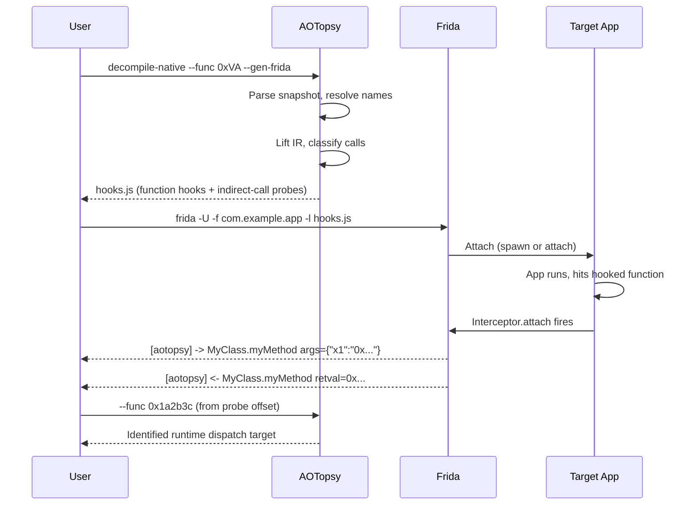
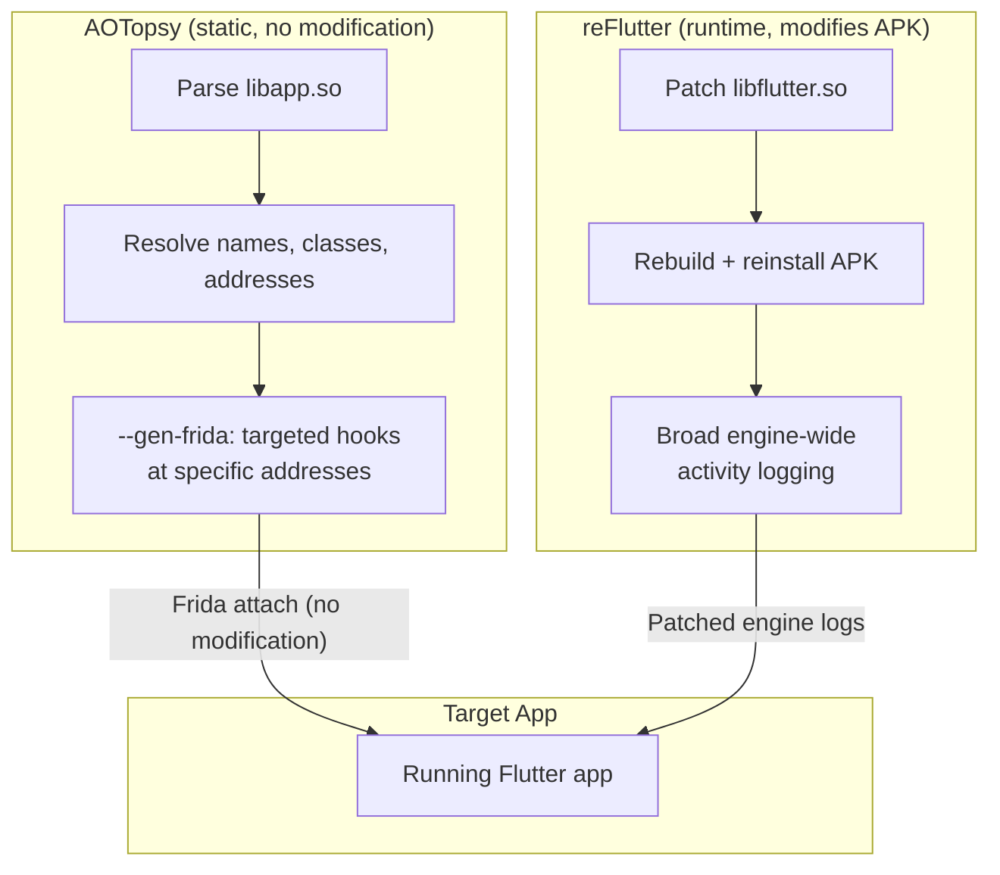

# Frida Script Generation

AOTopsy generates ready-to-run [Frida](https://frida.re) scripts that hook functions resolved during static analysis. This bridges the gap between what static analysis can determine (function names, call graphs, pseudocode) and what only runtime observation can reveal (argument values, virtual dispatch targets, code path reachability).



## Generating a Script

```bash
# One function
aotopsy _debug decompile-native --lib libapp.so --func 0x2bb4c4 --gen-frida

# Write to file
aotopsy _debug decompile-native --lib libapp.so --func 0x2bb4c4 \
  --gen-frida --gen-frida-out hooks.js

# Bulk mode -> <out>/hooks.js
aotopsy _debug decompile-native --lib libapp.so --all --filter MyClass \
  --gen-frida --out out/

aotopsy _debug decompile-native --lib libapp.so --from-main \
  --gen-frida --out out/
```

The script hooks by module-relative offset (`Process.getModuleByName(...).base.add(offset)`), so it works regardless of ASLR slide. The offset numbering matches `decompile-native`'s VA numbering — no manual math needed.

## Running It

```bash
frida -U -f <package.name> -l hooks.js --no-pause    # spawn fresh
frida -U <package.name> -l hooks.js                   # attach to running
```

Multiple scripts compose: `frida -U -f <pkg> -l hooks.js -l my_other_script.js --no-pause`

## What It Hooks

**Function entry/exit**: logs argument registers (only the real declared arity when confidently resolved, not the full register set) and return value.

```
[aotopsy] -> MyClass.myMethod @ 0x7f8a2bb4c4 args={"x1":"0x..."}
[aotopsy] <- MyClass.myMethod retval=0x...
```

**Indirect-call probes**: at every unresolved `dynamicCall(indirectTarget_xN, ...)` site, attaches directly at the instruction and reads the target register from live CPU context. Logs the real runtime target as a module-relative offset — paste it into `--func`/`--find` to identify what actually got called.

```
[aotopsy] probe ListBase._filter @ 0x7f8a2c137ee6: rcx=0x7f8a2c... (module+0x1a2b3c)
```

Probes are capped at a few hundred per script and skip memory-operand dispatch-table call shapes (no single register to read for those).

## Safety for Hardened Targets

For apps with anti-tamper defenses:

1. **Prefer attach over spawn.** Some apps watch for spawn+immediate-attach patterns. Wait a few seconds after launch before attaching.

2. **Interceptor.attach near indirect calls can crash the target.** The probes attach directly at BLR/CALL instructions in hot AOT-compiled code. A reproducible SIGSEGV was confirmed on a real app, even on a plain MOV several instructions before the risky CALL. If the target dies right as a probe would fire, that's likely this hazard, not a fluke.

3. **Don't run standalone against a hardened target.** If you already have a proven attach pipeline (anti-detection bypass, TLS bypass, spawn-timing fixes), concatenate the generated script into that existing bundle instead of running it alone. The generated script inherits the working attach mechanism rather than re-deriving it.

## Relationship to reFlutter



[reFlutter](https://github.com/Impact-I/reFlutter) patches `libflutter.so` (the Flutter engine) to dump Dart-level activity at runtime, then rebuilds and reinstalls the APK. AOTopsy's `--gen-frida` attaches to an already-installed, unmodified app — no engine patch, no rebuild, no reinstall.

They're complementary:
- **AOTopsy first** — resolve names, classes, call graph, and addresses statically
- **`--gen-frida` next** — hook specific addresses when static analysis hits a wall
- **reFlutter** — for broad engine-wide activity logging, not targeted hooks at specific addresses
