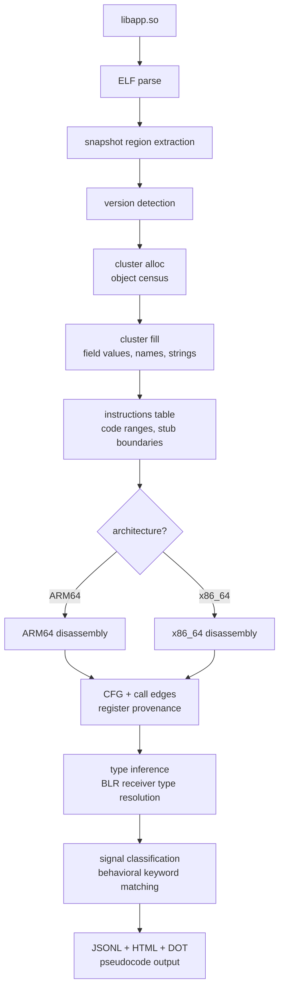
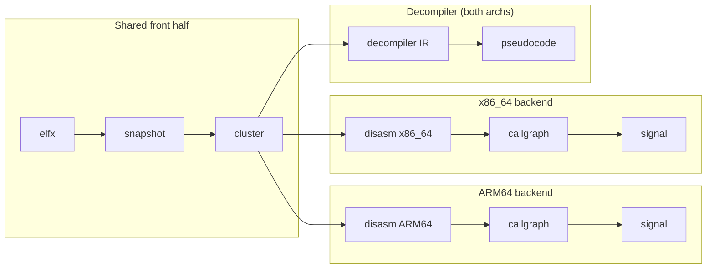
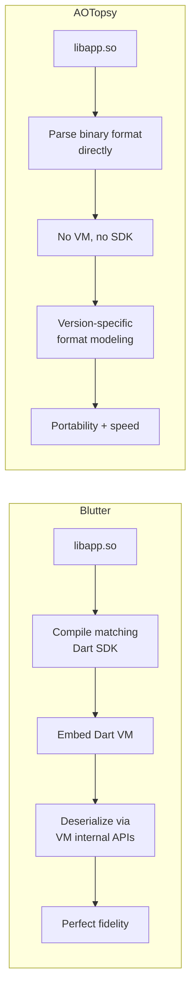

# AOTopsy

A Dart AOT snapshot analyzer. Turns `libapp.so` — the compiled Dart code inside a Flutter release APK — into function names, class layouts, call graphs, behavioral signals, and readable pseudocode. No Dart VM, no SDK compilation, no runtime fallback.

> **Fork notice:** AOTopsy is a fork of [unflutter](https://github.com/zboralski/unflutter) by [Anthony Zboralski](https://github.com/zboralski), extended with x86_64 support, a native decompiler, whole-program type inference, Frida script generation, and comprehensive documentation. All credit for the original snapshot parser, cluster deserializer, ARM64 disassembly pipeline, and Ghidra/IDA integration belongs to the original author.

## What It Recovers

| Output | What it is |
|--------|-----------|
| Function names | The original Dart name for each compiled function |
| Class structures | Field names, byte offsets, inheritance chains |
| Call graph | Direct (BL) and indirect (BLR/dispatch) call edges with provenance |
| String references | Which functions load which string literals from the object pool |
| Behavioral signals | Crypto, network, gambling, SIM, location, WebView, blockchain keyword classification |
| Pseudocode | Architecture-neutral decompiled output from ARM64 or x86_64 machine code |
| Dart Source Export | Whole-project modular `.dart` files reconstructed with classes, fields, and methods |

Supports **ARM64** and **x86_64**. Covers **Dart 2.10 through 3.12**.

## Quick Start

```bash
make build
./aotopsy libapp.so                    # full pipeline
./aotopsy doctor libapp.so             # quick diagnostic
./aotopsy export-dart --lib libapp.so --out ./lib  # reconstruct entire Dart source project
./aotopsy _debug decompile-native --lib libapp.so --find MyClass  # find and decompile a function
```

See `WORKFLOW.md` for the step-by-step methodology when you have a raw APK and don't know where to start.

## How It Works

AOTopsy treats the Dart AOT snapshot as a deterministic binary grammar. Every byte has exactly one correct interpretation given the right constraints (ELF structure, snapshot magic, version hash, CID table, cluster encoding). The parser applies constraints until only one interpretation survives — no heuristics, no guessing.

The pipeline runs in stages, each a pure function from bytes to structured data:



Two independent backends share the same front half (ELF through cluster fill), then split by architecture: `internal/disasm` for ARM64, `internal/disasm/x86.go` for x86_64. The decompiler (`internal/decompiler`) handles both architectures through a unified IR.



## Comparison With Blutter



[Blutter](https://github.com/aspect-sec/blutter) embeds the Dart VM to deserialize the snapshot through its own code paths. Perfect fidelity, but requires compiling a matching Dart SDK for every target version.

AOTopsy parses the binary format directly. No VM, no SDK. The tradeoff: every format change across Dart versions must be modeled explicitly. There is no runtime to handle it automatically.

## Commands

### Full pipeline

```bash
aotopsy libapp.so              # disasm + call edges + signal + metadata (ARM64: + Ghidra/IDA)
aotopsy signal libapp.so       # same, skip metadata
aotopsy libapp.so --graph      # also build call graph DOT files
```

Flags: `--out <dir>` (default: `<basename>.aotopsy/`), `--quiet`, `--strict`, `--max-steps <n>`, `--k <n>` (signal context depth, default 2).

### Diagnostic

```bash
aotopsy doctor libapp.so       # Dart version, pointer size, support status, build features
aotopsy find-libapp --apk app.apk  # locate libapp.so inside an APK
```

### Whole-Project Dart Source Export

Reconstructs all classes, fields, methods, getters, setters, and constructors into modular `.dart` files mapped by original library URIs:

```bash
aotopsy export-dart --lib libapp.so --out ./reconstructed_lib/   # full project export
aotopsy export-dart --lib libapp.so --out ./lib/ --app-only      # filter out core/flutter framework
aotopsy export-dart --lib libapp.so --out ./lib/ --filter Auth   # targeted export by name
```

### High-Level Native Decompiler (ARM64 + x86_64)

Produces clean, idiomatic Dart code directly from binary machine instructions:
- **Structural Control Flow**: `for-in` iterators, `while`, `for`, `try-catch-finally` with exact PC bounding.
- **Async/Await Linearization**: Unwraps `_SuspendState` state machines into linear `await future` and `await for`.
- **Lambda Inlining**: Synthesizes arrow callbacks `(item) => process(item)` directly at call sites.
- **Type Lattice**: Propagates concrete Dart types (`String`, `int`, `UserModel`) across SSA values without running a live VM.
- **Dart Idioms**: Null-aware (`?.`, `??`, `??=`), cascade (`..`), Set/List/Map literals, string interpolation (`"${a}${b}"`).

```bash
aotopsy _debug decompile-native --lib libapp.so --find MyClass         # locate by name
aotopsy _debug decompile-native --lib libapp.so --func 0x1a92728       # one function at a VA
aotopsy _debug decompile-native --lib libapp.so --from-main --out out/ # reachability from app entry
aotopsy _debug decompile-native --lib libapp.so --all --filter MyClass # bulk, filtered
```

Warning: `--all` without a small `--max` can require ~64GB RAM on a real app. Prefer `--find`/`--func`/`--from-main`.

### Ghidra / IDA (ARM64 only)

```bash
aotopsy ghidra libapp.so        # headless Ghidra with metadata injection
aotopsy ida libapp.so           # headless IDA via idalib
```

Both reject x86_64 input. Use `decompile-native` for x86_64 pseudocode.

### Frida script generation

```bash
aotopsy _debug decompile-native --lib libapp.so --func 0x1a92728 --gen-frida --gen-frida-out hooks.js
frida -U -f com.example.app -l hooks.js --no-pause
```

See `FRIDA.md` for the full guide.

### Cross-referencing and tracing

```bash
aotopsy _debug strings --lib libapp.so --find "X-Signature" --xref   # which function loads this string?
aotopsy _debug ffi-trace --lib libapp.so --filter MyClass            # dart:ffi call sites
aotopsy _debug dispatch-table --lib libapp.so --filter MyClass       # dispatch table entries
aotopsy _debug fingerprint --lib libapp.so                           # build-id and version markers
aotopsy _debug funcdiff --old old.so --new new.so                    # function set diff
aotopsy _debug symbolmap --stripped lib.so --unstripped debug.so     # resolve stripped targets
```

### Corpus tools

```bash
aotopsy inventory --dir samples/                    # catalog APKs
aotopsy parity --samples samples/ --out out/        # cross-version parse report
aotopsy _debug thr-audit -lib libapp.so -out thr.jsonl  # THR access scan
```

## Output Artifacts

| File | Contents |
|------|----------|
| `functions.jsonl` | Name, address, size, owner, param count per function |
| `call_edges.jsonl` | BL/BLR edges with resolved targets and provenance |
| `classes.jsonl` | Field names, offsets, instance sizes per class |
| `string_refs.jsonl` | String references from object pool loads |
| `signal.html` | Behavioral signal report with context graph |
| `flutter_meta.json` | Unified metadata for Ghidra/IDA (ARM64 only) |
| `asm/*.txt` | Annotated disassembly per function |
| `cfg/*.dot` | Per-function CFGs (with `--graph`) |

## Package Layout

```
cmd/aotopsy/          CLI entry point and command handlers
internal/
  elfx/               ELF validation and symbol extraction
  snapshot/           Snapshot region extraction, version profiles
  dartfmt/            Dart VM variable-length integer encoding
  cluster/            Two-phase snapshot deserialization (alloc + fill)
  disasm/             ARM64 + x86_64 decode, CFG, call-edge provenance
  callgraph/          Lattice graph builders for DOT rendering
  signal/             Behavioral string classification
  render/             HTML/DOT/SVG visualization
  output/             JSONL serialization
  decompiler/         Dart-AOT pseudocode decompiler (both architectures)
  typetrack/          Whole-program type inference for BLR resolution
  fingerprint/        Build-id and version marker identification
  funcdiff/           Function-set diffing between builds
  symbolmap/          Stripped-vs-unstripped symbol resolution
  ffitrace/           Static dart:ffi call-site tracing
  strxref/            String-to-function cross-referencing
  strutil/            Shared string utilities
  pipeline/           Pipeline orchestration and name resolution
tools/                Standalone utilities (THR table extractor)
ghidra_scripts/       Ghidra integration (Python)
ida_scripts/          IDA integration (Python)
```

See `ARCHITECTURE.md` for the deep dive into each package.

## Build

Requires Go 1.25+.

```bash
make build      # build ./aotopsy
make install    # install to ~/.aotopsy/bin
make test       # run tests
```

Integration tests use environment variables (`AOTOPSY_TEST_SAMPLE_*`) to locate sample binaries — they skip automatically if not set.

## Limitations

- **AOT only.** No JIT support.
- **Ghidra/IDA decompilation is ARM64-only.** x86_64 is rejected with a clear error — use `decompile-native` instead.
- **`--all` decompilation can crash the host.** A real full-size app needs ~64GB RAM for unbounded `--all`. Use targeted modes (`--find`, `--func`, `--from-main`) or cap with `--max`.
- **Virtual dispatch is invisible to `--from-main` reachability.** Widget lifecycle callbacks go through Flutter's framework dispatch, not direct call instructions. A class-touch heuristic recovers some, but it's an over-approximation. Use Frida for the rest.
- **Every Dart version change must be modeled.** There is no VM to handle format changes automatically.

## License

BSD-3-Clause. CID tables, THR field offsets, and stub names are derived from the [Dart SDK](https://github.com/dart-lang/sdk) (also BSD-3-Clause). See `LICENSE` and `NOTICE`.
