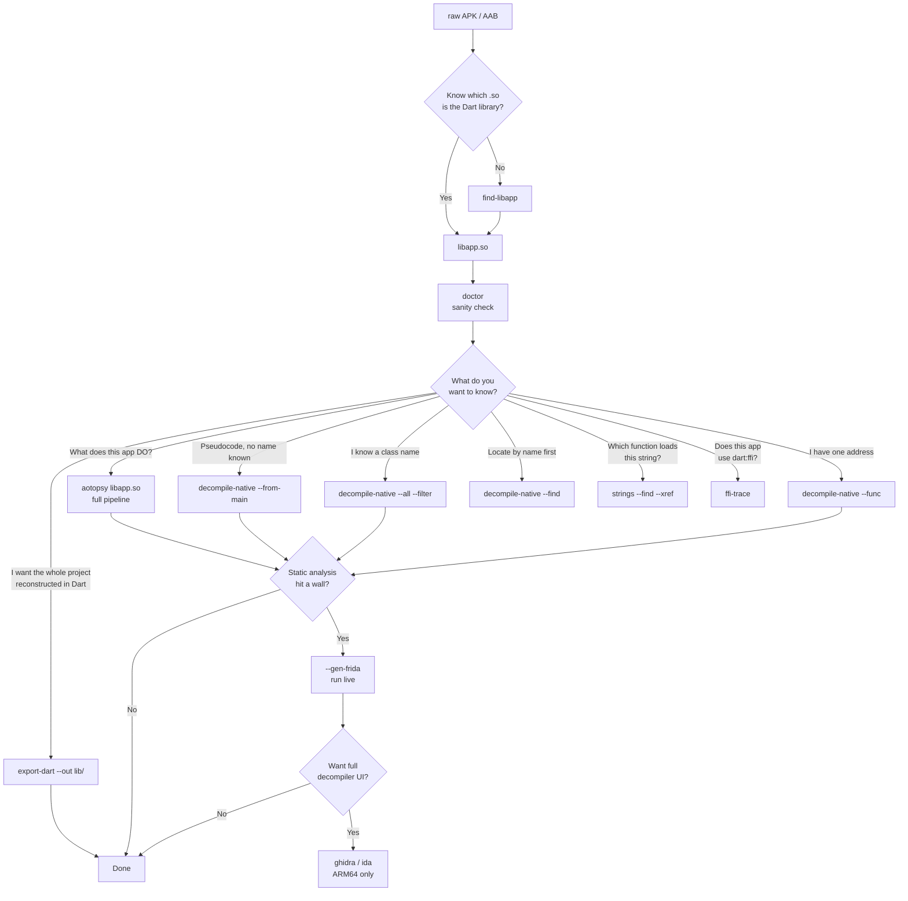

# AOTopsy — Analysis Workflow

A step-by-step guide for analyzing a Flutter app from a raw APK to decompiled pseudocode. Every command below has been verified against real binaries.

## Prerequisites

- A Flutter app's `libapp.so` (usually inside the APK at `lib/arm64-v8a/`)
- The `aotopsy` binary (`make build`)
- Optional: [Ghidra](https://ghidra-sre.org/) 11.x or [IDA Pro](https://hex-rays.com/) with idalib (ARM64 only)
- Optional: [Frida](https://frida.re/) for runtime hooks

## Decision Tree



## Step 0: Find the Dart library

```bash
aotopsy find-libapp --apk app-release.apk
```

Returns JSON with the matching `.so` path inside the APK, its SHA-256, snapshot hash, and Dart version. Only scans `arm64-v8a` — if the APK is x86_64-only or armeabi-v7a-only, this won't find it.

## Step 1: Sanity check

```bash
aotopsy doctor libapp.so
```

Output:

```
ELF:        OK (40371104 bytes)
Snapshot:    OK
Dart:        3.7.0
Pointers:    compressed (4 bytes)
Support:     OK
Hash:        d91c0e6f35f0eb2e44124e8f42aa44a7
Features:    product no-code_comments dwarf_stack_traces_mode dedup_instructions ...
```

The `Features:` line reveals build-time flags. `dwarf_stack_traces_mode` means the compiler discarded most `Code` objects to shrink the snapshot — AOTopsy still recovers their names, but `_debug refinfo` will show fewer Code entries than the real function count.

If `Support: UNSUPPORTED` appears, the Dart version isn't recognized. Check the version table in `ARCHITECTURE.md`.

## Step 2: Broad pass — what does the app do?

```bash
aotopsy libapp.so          # full pipeline: disasm + call edges + signal + meta
# or:
aotopsy signal libapp.so   # skip metadata, just signal analysis
```

Produces `signal.html` (behavioral report), `functions.jsonl`, `call_edges.jsonl`, `classes.jsonl`. This is orientation — "where are the interesting strings and what do they connect to" — not readable code yet.

## Step 2.5: Whole-project source reconstruction

Export reconstructed, modular `.dart` files organizing classes, constructors, methods, and getters/setters mapped by original library URIs:

```bash
# Reconstruct entire application source code:
aotopsy export-dart --lib libapp.so --out ./reconstructed_lib/

# Reconstruct only application-specific code (skip Flutter framework & Dart SDK):
aotopsy export-dart --lib libapp.so --out ./lib/ --app-only

# Filter specific module/feature:
aotopsy export-dart --lib libapp.so --out ./lib/ --filter Auth
```

## Step 3: Targeted decompilation

Pick the right mode based on what you know:

| You know... | Use |
|---|---|
| Nothing, no name | `--from-main` (walks the call graph from the app's entry point) |
| A class/package name | `--all --filter <substring>` (cap with `--max`) |
| A function name | `--find <substring>` to get its VA, then `--func <hex VA>` |
| One specific address | `--func <hex VA>` |

```bash
aotopsy _debug decompile-native --lib libapp.so --find MathTools
# 0x1b7e54  size=96  MathTools.factorial

aotopsy _debug decompile-native --lib libapp.so --func 0x1b7e54
# dynamic MathTools_factorial(dynamic arg0) {
#   local_m8 = arg0;
#   if ((x15 - 8) <= THR.f56) {
#     final t1 = StackOverflowSharedWithoutFPURegs(arg0, arg0, x2, x3);
#     ...
```

Warning: `--all` without a small `--max` can need ~64GB RAM and crash the host. Use targeted modes whenever possible.

## Step 3.5: Cross-referencing

**"Which function loads this string?"**

```bash
aotopsy _debug strings --lib libapp.so --find "X-Signature" --xref
```

Scans every function's IR for a matching pool load. Unbounded by default — safe even on a 129,000-function binary (9.3 seconds, flat memory).

**"Does this app call native code via dart:ffi?"**

```bash
aotopsy _debug ffi-trace --lib libapp.so --filter MyClass
```

Finds `DynamicLibrary.open`/`.lookup` call sites and resolves literal library/symbol names. Bounded to 500 functions by default — use `--filter` to narrow scope.

**"What does the dispatch table contain?"**

```bash
aotopsy _debug dispatch-table --lib libapp.so --filter MyClass
```

Whole-table dump of the AOT snapshot's `DispatchTable`. Not a per-call-site resolver — recovering one specific call site's target without knowing the runtime receiver class is unsound (each resolves to hundreds-to-thousands of candidates). Works for Dart 3.1.0–3.12.2 only.

## Step 4: When static analysis hits a wall

Three situations where `decompile-native` alone can't answer the question:

1. **A specific argument value or code path reachability** → `--gen-frida`, run the script live
2. **Virtual dispatch `--from-main` couldn't reach** → hook the candidate function with Frida
3. **An entry-point argument supplied by the VM** → Frida is the only way past this boundary

```bash
aotopsy _debug decompile-native --lib libapp.so --func 0x1b7e54 --gen-frida --gen-frida-out hooks.js
frida -U -f com.example.app -l hooks.js --no-pause
```

For hardened/anti-tamper targets, prefer attach over spawn. See `FRIDA.md` for safety details.

## Step 5: Full decompiler UI (ARM64 only)

```bash
aotopsy ghidra libapp.so
aotopsy ida libapp.so
```

x86_64 is not supported — Ghidra's `createFunction()` follows control flow past real function boundaries on x86_64 due to variable-length instruction encoding. Use `decompile-native` for x86_64.

## Corpus tools

For maintaining AOTopsy itself (adding Dart versions, auditing coverage):

```bash
aotopsy inventory --dir samples/                          # catalog APKs
aotopsy parity --samples samples/ --out out/              # cross-version report
aotopsy _debug find-libapp-batch --dir samples/ --out out/ # batch find-libapp
aotopsy _debug thr-audit -lib libapp.so -out thr.jsonl     # THR access scan
```

`_debug thr-cluster` and `_debug thr-classify` group unresolved THR offsets into bands and categories — the workflow used to extend AOTopsy's Thread field table to new Dart versions.

## Memory safety

- Never run `--all` unbounded, or with `--max` set to the full function count. ~64GB RAM needed. Two confirmed host crashes on a 5.8GB-RAM machine.
- Never run multiple heavy operations in parallel on a memory-constrained machine.
- Prefer `--find`/`--func` over `--all`. If you must sweep, use bounded shards (`--max`/`--skip`).
